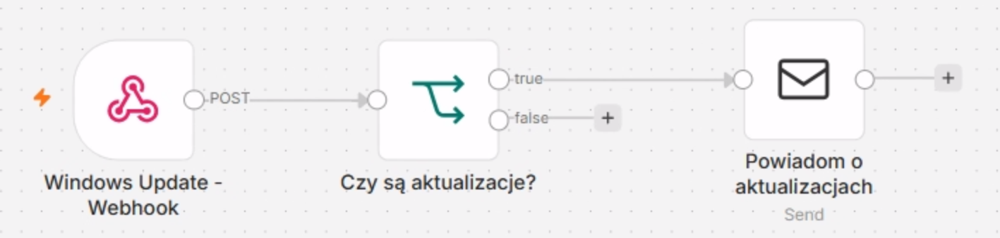

# Windows Update Automation z PowerShell i n8n

> Automatyczne sprawdzanie, instalowanie i raportowanie aktualizacji
> Windows z wykorzystaniem PowerShell, Windows Task Scheduler oraz n8n.


## O projekcie

Projekt jest częścią mojego **Home IT Lab** i przedstawia kompletną
automatyzację procesu Windows Update.

Windows Task Scheduler uruchamia skrypty PowerShell z podwyższonymi
uprawnieniami. Skrypty komunikują się z Windows Update przez COM API, a
następnie przesyłają wynik wykonania w formacie JSON do webhooka n8n.
n8n analizuje otrzymany status i wysyła odpowiednie powiadomienie
e-mail.

Projekt składa się z dwóch głównych workflow:

-   **CHECK** --- sprawdza dostępność aktualizacji Windows i przekazuje
    wynik do n8n.
-   **INSTALL** --- pobiera i instaluje aktualizacje, analizuje wynik
    oraz konieczność restartu i raportuje rezultat do n8n.

## Architektura

``` text
Windows Task Scheduler
          |
          v
      PowerShell
          |
          v
 Windows Update COM API
          |
          | HTTPS POST / JSON
          v
      n8n Webhook
          |
          v
   Analiza statusu
       /     \
      /       \
 SUCCESS     FAILED
      \       /
       \     /
    Raport e-mail
```

## Jak to działa?

1.  **Windows Task Scheduler** automatycznie uruchamia skrypt PowerShell
    z podwyższonymi uprawnieniami.
2.  **PowerShell** sprawdza lub instaluje aktualizacje za pomocą Windows
    Update COM API.
3.  Skrypt przesyła wynik do **n8n** przez HTTPS Webhook w formacie
    JSON.
4.  **n8n** analizuje rezultat i wysyła raport e-mail. Workflow INSTALL
    dodatkowo sprawdza, czy system wymaga restartu.

------------------------------------------------------------------------

## Windows Update - CHECK

Workflow **CHECK** odpowiada za monitorowanie dostępności aktualizacji
Windows.

Skrypt PowerShell wyszukuje oczekujące aktualizacje, przygotowuje raport
zawierający nazwę hosta, datę, liczbę aktualizacji oraz ich szczegóły, a
następnie wysyła dane do n8n.

n8n może na tej podstawie powiadomić administratora o dostępnych
aktualizacjach.

### Workflow n8n



------------------------------------------------------------------------

## Windows Update - INSTALL

Workflow **INSTALL** odpowiada za właściwy proces instalacji
aktualizacji i raportowanie jego wyniku.

Skrypt PowerShell:

-   wyszukuje dostępne aktualizacje,
-   akceptuje wymagane EULA,
-   pobiera i instaluje aktualizacje,
-   analizuje `ResultCode` oraz `HRESULT` poszczególnych aktualizacji,
-   sprawdza, czy wymagany jest restart,
-   przesyła końcowy raport do n8n.

n8n analizuje otrzymany status i kieruje wykonanie do odpowiedniej
ścieżki **SUCCESS** lub **FAILED**, po czym wysyła raport e-mail.

### Workflow n8n


------------------------------------------------------------------------

## Przykładowy raport do n8n

PowerShell przesyła wynik do webhooka n8n metodą HTTP POST z nagłówkiem
`Content-Type: application/json`.

``` json
{
  "host": "WINDOWS-CLIENT",
  "date": "2026-09-15 09:35:08",
  "status": "SUCCESS",
  "found": 2,
  "installed": 2,
  "resultCode": 2,
  "rebootRequired": true,
  "error": "",
  "updates": []
}
```

Dzięki takiemu podziałowi **PowerShell** odpowiada za operacje
systemowe, natomiast **n8n** za logikę workflow i raportowanie.

## Automatyczne uruchamianie

Skrypty mogą działać bezobsługowo dzięki **Windows Task Scheduler**.

Przykładowa akcja:

``` powershell
powershell.exe -NoProfile -ExecutionPolicy Bypass -File "C:\Scripts\WindowsUpdate-Install.ps1"
```

Zadanie odpowiedzialne za instalowanie aktualizacji powinno działać z
opcją:

> **Run with highest privileges**

Podwyższone uprawnienia są wymagane do wykonywania operacji związanych z
instalacją aktualizacji Windows.

## Struktura projektu

``` text
windows-update-automation/
├── scripts/
│   ├── WindowsUpdate-Check.ps1
│   └── WindowsUpdate-Install.ps1
├── workflows/
│   ├── windows-update-check.json
│   └── windows-update-install.json
├── screenshots/
│   ├── WindowsUpdate-CHECK.png
│   └── WindowsUpdate-INSTALL.png
└── README.md
```

-   `scripts/` --- skrypty PowerShell odpowiedzialne za Windows Update i
    raportowanie do n8n.
-   `workflows/` --- eksporty workflow n8n dla procesów CHECK i INSTALL.
-   `screenshots/` --- zrzuty ekranu przedstawiające przygotowane
    workflow.

## Bezpieczeństwo

Publiczna wersja projektu nie powinna zawierać sekretów ani informacji
charakterystycznych dla rzeczywistego środowiska.

Przed publikacją należy usunąć lub zastąpić:

-   rzeczywiste adresy webhooków,
-   adresy e-mail,
-   dane uwierzytelniające i hasła,
-   tokeny API,
-   prywatne adresy IP,
-   inne dane środowiskowe, których nie chcemy publikować.

Przykładowy placeholder:

``` powershell
$WebhookUrl = "https://n8n.example.com/webhook/windows-update-install"
```

Dane dostępowe SMTP i innych usług powinny być przechowywane jako
**Credentials w n8n**, a nie bezpośrednio w skryptach lub definicjach
workflow.

## Dalszy rozwój

Projekt można rozbudować m.in. o:

-   centralną obsługę wielu komputerów Windows,
-   maintenance windows,
-   historię wykonanych aktualizacji,
-   zbiorcze raportowanie,
-   obsługę restartu z uwzględnieniem aktywnych użytkowników,
-   centralny dashboard stanu aktualizacji,
-   integrację z Zabbix,
-   integrację z Wazuh,
-   automatyczną analizę błędów i remediację.

## Cel projektu

Celem projektu jest praktyczne połączenie klasycznej administracji
systemami Windows z automatyzacją:

**PowerShell + Windows Update + Task Scheduler + REST/Webhook + n8n**

Projekt pozwala rozwijać praktyczne umiejętności związane z
administracją Windows, automatyzacją procesów, komunikacją pomiędzy
systemami, obsługą błędów oraz raportowaniem stanu infrastruktury.