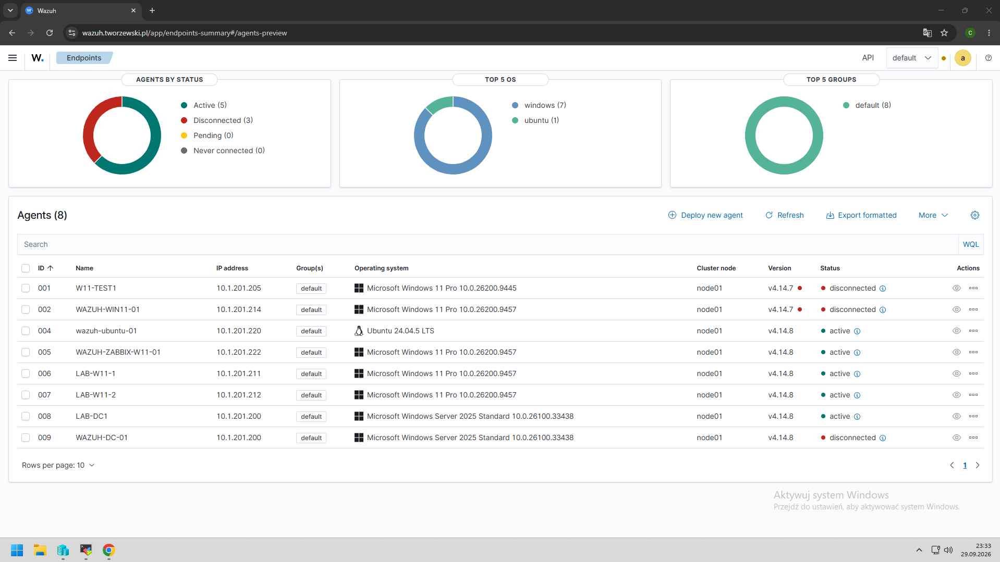

# Architektura środowiska Wazuh Lab

## Cel dokumentu

Dokument opisuje aktualną architekturę środowiska laboratoryjnego wykorzystywanego do nauki monitoringu bezpieczeństwa z użyciem Wazuh.

Środowisko służy do testowania:

- monitorowania zdarzeń systemu Windows,
- analizy logów bezpieczeństwa,
- monitoringu Active Directory,
- File Integrity Monitoring,
- monitoringu PowerShell,
- tworzenia własnych reguł Wazuh,
- analizy alertów i scenariuszy bezpieczeństwa.

---

## Aktualna architektura

```text
                         ┌────────────────────┐
                         │     WAZUH-SRV      │
                         │   Ubuntu Server    │
                         │   Wazuh Manager    │
                         └─────────┬──────────┘
                                   │
                   ┌───────────────┼───────────────┐
                   │               │               │
                   │               │               │
          ┌────────▼───────┐ ┌────▼─────────┐ ┌───▼──────────┐
          │    LAB-DC1     │ │  LAB-W11-1   │ │  LAB-W11-2  │
          │ Windows Server │ │  Windows 11   │ │  Windows 11  │
          │      2025      │ │ Workstation   │ │ Workstation  │
          │                │ │               │ │              │
          │ Active         │ │ Domain        │ │ Domain       │
          │ Directory      │ │ workstation   │ │ workstation  │
          │ Domain         │ │               │ │              │
          │ Controller     │ │               │ │              │
          └────────────────┘ └───────────────┘ └──────────────┘
```

Każdy host Windows posiada zainstalowanego agenta Wazuh i przesyła dane do centralnego serwera `WAZUH-SRV`.

---

## Hosty

### WAZUH-SRV

**System:** Ubuntu Server  
**Rola:** Wazuh Manager

Główne zadania:

- odbieranie zdarzeń z agentów,
- analiza logów,
- generowanie alertów,
- przechowywanie informacji o zdarzeniach,
- udostępnianie danych w interfejsie Wazuh Dashboard,
- obsługa reguł detekcyjnych.

---

### LAB-DC1

**System:** Windows Server 2025  
**Rola:** Kontroler domeny Active Directory

Host będzie wykorzystywany do testów związanych z:

- logowaniem domenowym,
- tworzeniem i usuwaniem użytkowników,
- zmianą członkostwa w grupach,
- monitoringiem grup uprzywilejowanych,
- analizą Windows Security Event Log,
- testami polityk audytu.

Na serwerze zainstalowany jest agent Wazuh.

---

### LAB-W11-1

**System:** Windows 11  
**Rola:** Stacja robocza w domenie

Host będzie wykorzystywany do:

- generowania zdarzeń logowania,
- testów PowerShell,
- testów Windows Defender,
- File Integrity Monitoring,
- testowania reakcji Wazuh na zdarzenia użytkownika.

Na stacji zainstalowany jest agent Wazuh.

---

### LAB-W11-2

**System:** Windows 11  
**Rola:** Stacja robocza w domenie

Druga stacja robocza umożliwia:

- testowanie zdarzeń z wielu endpointów,
- porównywanie alertów pomiędzy hostami,
- generowanie niezależnych scenariuszy bezpieczeństwa,
- testowanie reguł Wazuh na więcej niż jednym komputerze.

Na stacji zainstalowany jest agent Wazuh.

---

## Przepływ danych

Podstawowy przepływ zdarzeń wygląda następująco:

```text
Windows Event
      ↓
Wazuh Agent
      ↓
WAZUH-SRV
      ↓
Decoder / Rule
      ↓
Alert
      ↓
Analiza w Wazuh Dashboard
```

Dzięki temu możliwe jest prześledzenie całej ścieżki od wygenerowania zdarzenia na hoście do pojawienia się alertu w Wazuh.

---

## Aktualny stan środowiska

- [x] Wazuh Manager działa
- [x] LAB-DC1 posiada agenta Wazuh
- [x] LAB-W11-1 posiada agenta Wazuh
- [x] LAB-W11-2 posiada agenta Wazuh
- [x] Agenty są widoczne w Wazuh
- [ ] Skonfigurowano rozszerzony Windows Audit Policy
- [ ] Wykonano pierwszy scenariusz bezpieczeństwa
- [ ] Dodano własne reguły Wazuh
- [ ] Skonfigurowano File Integrity Monitoring
- [ ] Skonfigurowano monitoring PowerShell
- [ ] Skonfigurowano alerty dla wybranych zdarzeń

---

## Potwierdzenie działania agentów

Poniższy zrzut przedstawia aktywne agenty Wazuh wykorzystywane w środowisku laboratoryjnym.



W momencie wykonywania testu aktywne były:

- `LAB-DC1`
- `LAB-W11-1`
- `LAB-W11-2`

Wszystkie trzy hosty poprawnie komunikowały się z serwerem Wazuh Manager.

---

## Planowane scenariusze

W środowisku będą realizowane między innymi następujące testy:

1. nieudane logowanie do domeny,
2. utworzenie użytkownika Active Directory,
3. usunięcie użytkownika Active Directory,
4. dodanie użytkownika do grupy,
5. dodanie użytkownika do grupy uprzywilejowanej,
6. monitoring PowerShell,
7. File Integrity Monitoring,
8. zatrzymanie agenta Wazuh,
9. analiza zdarzeń Microsoft Defender,
10. tworzenie własnych reguł detekcyjnych.

---

## Dokumentacja wizualna

Zrzuty ekranu związane z architekturą oraz agentami będą przechowywane w katalogach:

```text
wazuh/screenshots/architecture/
wazuh/screenshots/agents/
```

Przykładowe pliki:

```text
wazuh-agents.png
wazuh-lab-architecture.png
```

---

## Uwagi bezpieczeństwa

Repozytorium nie powinno zawierać:

- haseł,
- kluczy agentów,
- tokenów API,
- certyfikatów prywatnych,
- danych użytkowników,
- produkcyjnych adresów i konfiguracji zawierających dane wrażliwe.

Projekt jest przeznaczony wyłącznie do pracy w kontrolowanym środowisku laboratoryjnym.
