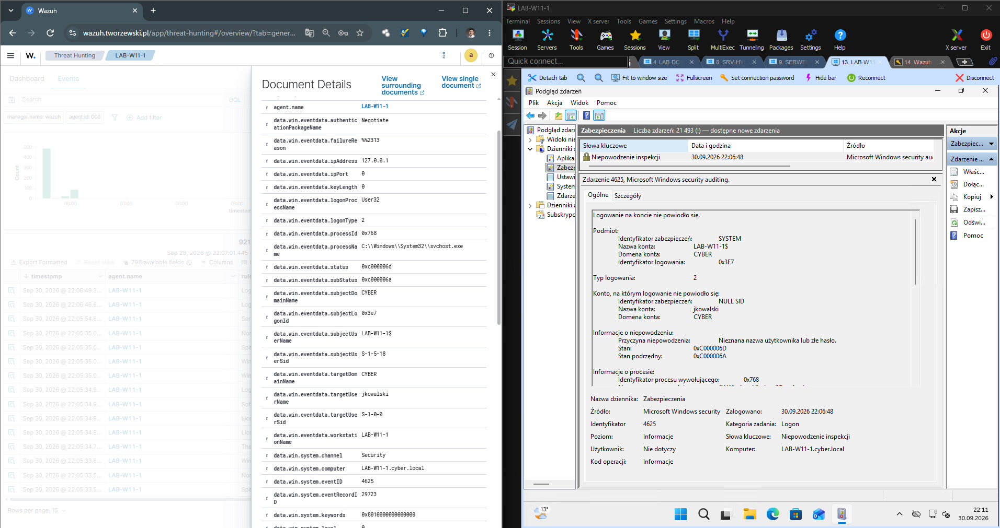
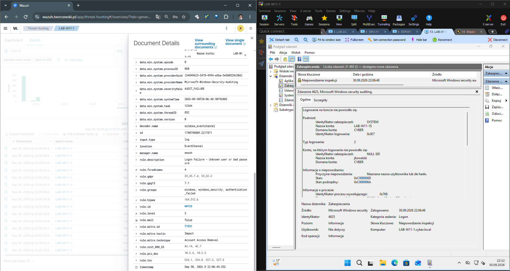

# 02 - Wykrywanie nieudanego logowania przy użyciu domyślnej reguły Wazuh

## Cel scenariusza

Celem testu było sprawdzenie, czy Wazuh poprawnie wykrywa nieudane logowanie do systemu Windows przy użyciu **domyślnych reguł**, bez tworzenia własnej reguły detekcyjnej.

---

## Środowisko testowe

| Host | Rola |
|---|---|
| `LAB-W11-1` | Windows 11 / stacja robocza w domenie |
| `WAZUH-SRV` | Wazuh Manager |

Na `LAB-W11-1` zainstalowany jest agent Wazuh przesyłający zdarzenia bezpieczeństwa do `WAZUH-SRV`.

---

## Przebieg testu

Na stacji `LAB-W11-1` wykonano próbę logowania przy użyciu nieprawidłowych danych uwierzytelniających.

Windows zarejestrował zdarzenie bezpieczeństwa:

```text
Event ID: 4625
```

Dla testowanego zdarzenia widoczne były między innymi:

```text
Target User: jkowalski
Target Domain: CYBER
Logon Type: 2
Status: 0xC000006D
SubStatus: 0xC000006A
```

---

## Windows Event ID 4625 i odbiór zdarzenia przez Wazuh

Poniższy zrzut pokazuje jednocześnie:

- po prawej: zdarzenie `4625` w Podglądzie zdarzeń Windows,
- po lewej: to samo zdarzenie odebrane przez agenta i widoczne w Wazuh.



Dzięki zestawieniu obu widoków można bezpośrednio porównać zdarzenie źródłowe w Windows z danymi zarejestrowanymi w Wazuh.

---

## Domyślna reguła Wazuh 60122

Wazuh poprawnie zdekodował zdarzenie Windows i sklasyfikował je przy użyciu domyślnej reguły:

```text
Rule ID: 60122
Rule level: 5
Description: Logon Failure - Unknown user or bad password
```

Poniższy zrzut pokazuje szczegóły zdarzenia w Wazuh wraz z odpowiadającym mu zdarzeniem `4625` w Windows.



W danych Wazuh widoczne są między innymi:

```text
agent.name: LAB-W11-1
data.win.system.eventID: 4625
data.win.eventdata.targetUserName: jkowalski
data.win.eventdata.targetDomainName: CYBER
data.win.eventdata.logonType: 2
rule.id: 60122
rule.level: 5
```

Na tym etapie projektu **nie zastosowano własnej reguły Wazuh**.

---

## Event ID a Rule ID

W tym scenariuszu występują dwa różne identyfikatory:

```text
Windows Event ID: 4625
Wazuh Rule ID:    60122
```

`4625` identyfikuje zdarzenie wygenerowane przez system Windows.

`60122` identyfikuje domyślną regułę Wazuh, która rozpoznała i sklasyfikowała odebrane zdarzenie.

```text
Nieudana próba logowania
          ↓
Windows Security Log
          ↓
Event ID 4625
          ↓
Wazuh Agent
          ↓
Wazuh Manager
          ↓
Default Rule 60122
          ↓
Alert w Wazuh
```

---

## Wynik testu

Test zakończył się powodzeniem.

- [x] Windows zarejestrował nieudaną próbę logowania.
- [x] Wygenerowany został Event ID `4625`.
- [x] Agent Wazuh przesłał zdarzenie do managera.
- [x] Wazuh poprawnie odczytał dane zdarzenia.
- [x] Zdarzenie zostało sklasyfikowane przez domyślną regułę `60122`.
- [x] Alert otrzymał poziom `5`.
- [x] Do wykrycia zdarzenia nie była potrzebna własna reguła.

---

## Wniosek

Domyślny ruleset Wazuh poprawnie wykrył podstawowy przypadek nieudanego logowania Windows.

Przed tworzeniem własnych reguł warto najpierw sprawdzić, czy dane zdarzenie jest już obsługiwane przez standardowy ruleset Wazuh. Własne reguły można dodać później, gdy potrzebne będą dodatkowe warunki, korelacja kilku zdarzeń lub inny poziom alertu.

---

## Pliki związane ze scenariuszem

```text
wazuh/
├── docs/
│   └── 02-failed-logon-default-rule.md
└── screenshots/
    └── detections/
        ├── 01-event-4625-and-wazuh-overview.png
        └── 02-event-4625-and-wazuh-details-60122.png
```
