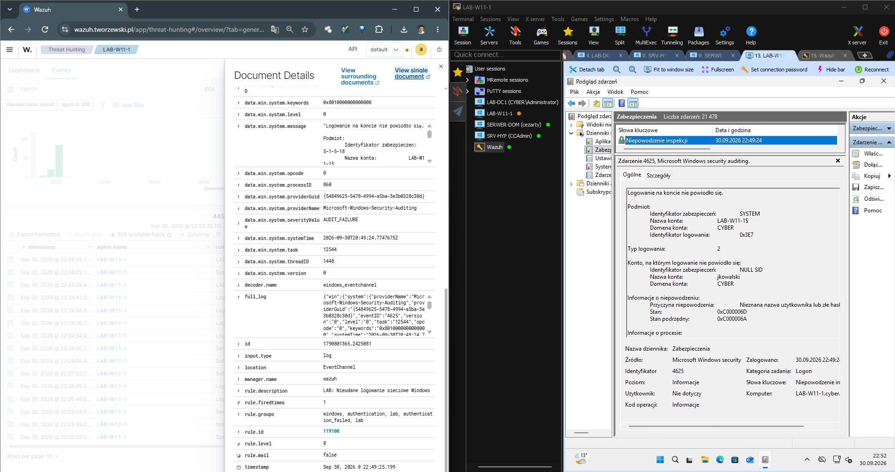
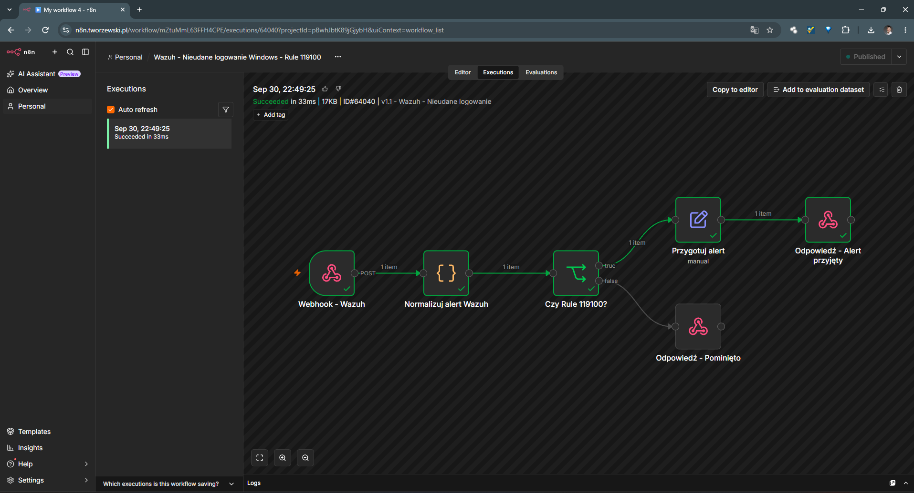
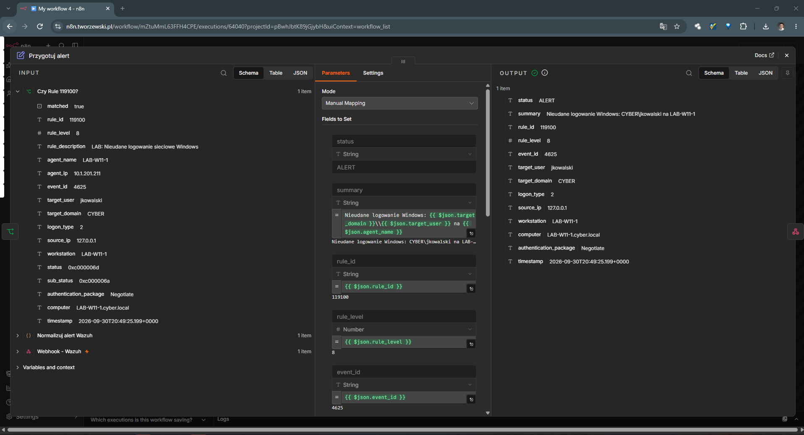

# 03 - Własna reguła Wazuh i integracja z n8n

## Cel projektu

Celem tego etapu było rozszerzenie domyślnej detekcji Wazuh o własną regułę oraz przekazanie wygenerowanego alertu do n8n przez webhook.

Scenariusz obejmuje pełny przepływ:

```text
Nieudane logowanie Windows
        ↓
Windows Event ID 4625
        ↓
Domyślna reguła Wazuh 60122
        ↓
Własna reguła Wazuh 119100
        ↓
Wazuh Integration
        ↓
Webhook HTTPS
        ↓
n8n
        ↓
Normalizacja danych
        ↓
Weryfikacja Rule ID
        ↓
Przygotowanie alertu
```

Projekt jest rozwinięciem wcześniejszego scenariusza, w którym zdarzenie `4625` było wykrywane wyłącznie przez domyślny ruleset Wazuh.

---

## Środowisko

| Element | Rola |
|---|---|
| `LAB-W11-1` | Windows 11 / źródło zdarzenia |
| `WAZUH-SRV` | Wazuh Manager |
| Wazuh Agent | Przesyłanie zdarzeń z Windows |
| n8n | Automatyzacja i dalsza obsługa alertu |

---

## 1. Zdarzenie źródłowe Windows

Test rozpoczyna się od nieudanej próby logowania na `LAB-W11-1`.

Windows zapisuje zdarzenie:

```text
Event ID: 4625
```

Wazuh odbiera zdarzenie za pośrednictwem agenta.

Domyślna reguła Wazuh odpowiedzialna za jego klasyfikację:

```text
Rule ID: 60122
Description: Logon Failure - Unknown user or bad password
```

---

## 2. Własna reguła Wazuh

Na bazie domyślnej reguły `60122` została utworzona własna reguła:

```text
Rule ID: 119100
Rule level: 8
```

Reguła wykorzystuje `if_sid`, dzięki czemu nie musi ponownie rozpoznawać całego zdarzenia Windows. Jest sprawdzana dopiero wtedy, gdy zdarzenie wcześniej pasowało do reguły `60122`.

Przykładowa finalna konfiguracja:

```xml
<group name="windows,authentication,lab,">

  <rule id="119100" level="8">
    <if_sid>60122</if_sid>
    <field name="win.eventdata.logonType">^2$</field>
    <description>LAB: Nieudane logowanie interaktywne Windows</description>
    <group>authentication_failed,lab,</group>
  </rule>

</group>
```

### Znaczenie elementów

```text
119100        - własny Rule ID
level="8"     - poziom alertu
if_sid 60122  - reguła bazowa Wazuh
logonType 2   - logowanie interaktywne
```

> Uwaga: na zrzucie wykonanym podczas testu opis reguły zawiera jeszcze tekst
> `Nieudane logowanie sieciowe Windows`. Warunek testowany w tym scenariuszu
> to jednak `Logon Type 2`. W finalnej wersji opisu warto użyć słowa
> `interaktywne`, aby nazwa odpowiadała logice reguły.

---

## 3. Walidacja reguły

Przed restartem Wazuh konfigurację można zweryfikować:

```bash
/var/ossec/bin/wazuh-analysisd -t
echo $?
```

Oczekiwany kod zakończenia:

```text
0
```

Po poprawnej walidacji:

```bash
systemctl restart wazuh-manager
systemctl status wazuh-manager --no-pager
```

---

## 4. Wynik w Wazuh

Po ponownym wygenerowaniu nieudanego logowania Wazuh zastosował własną regułę `119100`.



Na zrzucie widoczne są między innymi:

```text
rule.id: 119100
rule.level: 8
rule.description: LAB: Nieudane logowanie sieciowe Windows
```

Zdarzenie źródłowe nadal pochodzi z:

```text
Windows Event ID: 4625
```

Oznacza to, że domyślna detekcja Wazuh została rozszerzona o własną logikę.

---

## 5. Integracja Wazuh z n8n

W `ossec.conf` została skonfigurowana własna integracja kierująca alert `119100` do webhooka n8n.

Przykład:

```xml
<integration>
  <name>custom-n8n-failed-logon</name>
  <hook_url>https://n8n.tworzewski.pl/webhook/wazuh-failed-logon</hook_url>
  <rule_id>119100</rule_id>
  <alert_format>json</alert_format>
</integration>
```

Dzięki filtrowaniu po `rule_id` do tego webhooka przekazywane są tylko alerty odpowiadające regule `119100`.

---

## 6. Skrypt custom integration

W katalogu:

```text
/var/ossec/integrations/
```

utworzono skrypt:

```text
custom-n8n-failed-logon
```

Jego zadaniem jest:

1. odebranie pliku JSON alertu wygenerowanego przez Wazuh,
2. pobranie adresu webhooka z konfiguracji integracji,
3. wykonanie żądania HTTP `POST`,
4. przesłanie alertu do n8n jako JSON.

Plik integracji powinien być wykonywalny i posiadać odpowiednie uprawnienia, np.:

```bash
chmod 750 /var/ossec/integrations/custom-n8n-failed-logon
chown root:wazuh /var/ossec/integrations/custom-n8n-failed-logon
```

Konfigurację Integratora można zweryfikować:

```bash
/var/ossec/bin/wazuh-integratord -t
echo $?
```

---

## 7. Problem z certyfikatem HTTPS

Podczas pierwszego testu połączenia `WAZUH-SRV → n8n` pojawił się błąd:

```text
SSL certificate problem: unable to get local issuer certificate
```

`n8n.tworzewski.pl` korzysta z certyfikatu wystawionego przez prywatny:

```text
Tworzewski LAB Root CA
```

Certyfikat Root CA został dodany do zaufanych certyfikatów systemu Ubuntu.

Przykład:

```bash
cp tworzewski-lab-ca.crt \
/usr/local/share/ca-certificates/tworzewski-lab-ca.crt

update-ca-certificates
```

Po aktualizacji magazynu CA test:

```bash
curl -I https://n8n.tworzewski.pl
```

zwrócił:

```text
HTTP/2 200
```

Dzięki temu integracja może korzystać z HTTPS bez wyłączania weryfikacji certyfikatu.

---

## 8. Workflow n8n

Workflow odbiera alert z Wazuh i wykonuje kolejne kroki:

```text
Webhook - Wazuh
        ↓
Normalizuj alert Wazuh
        ↓
Czy Rule 119100?
       / \
    TRUE FALSE
      ↓    ↓
Przygotuj alert
      ↓
Odpowiedź - Alert przyjęty

FALSE → Odpowiedź - Pominięto
```



Na zrzucie widać poprawnie zakończone wykonanie workflow.

---

## 9. Normalizacja danych alertu

Node `Normalizuj alert Wazuh` przetwarza surowy JSON i przygotowuje pola przydatne w dalszej automatyzacji.

W aktualnym scenariuszu n8n poprawnie odczytał:

```text
rule_id:                119100
rule_level:             8
event_id:               4625
target_user:            jkowalski
target_domain:          CYBER
logon_type:             2
source_ip:              127.0.0.1
workstation:            LAB-W11-1
computer:               LAB-W11-1.cyber.local
authentication_package: Negotiate
```



Dzięki normalizacji kolejne node'y nie muszą operować bezpośrednio na rozbudowanej strukturze JSON Wazuh.

---

## 10. Warunek Rule ID

Workflow zawiera warunek:

```text
Czy Rule 119100?
```

Jeżeli:

```text
rule_id = 119100
```

alert jest przekazywany do dalszego przetwarzania.

Jeżeli Rule ID jest inne, workflow przechodzi ścieżką:

```text
Odpowiedź - Pominięto
```

Pozwala to dodatkowo kontrolować dane po stronie n8n.

---

## 11. Wynik testu end-to-end

Cały scenariusz zakończył się powodzeniem.

- [x] Windows wygenerował Event ID `4625`.
- [x] Wazuh odebrał zdarzenie.
- [x] Domyślna reguła `60122` rozpoznała nieudane logowanie.
- [x] Własna reguła `119100` została uruchomiona.
- [x] Alert otrzymał poziom `8`.
- [x] Wazuh Integration uruchomił custom integration.
- [x] Połączenie HTTPS do n8n działa z poprawną weryfikacją certyfikatu.
- [x] Webhook n8n odebrał alert.
- [x] Workflow rozpoznał `Rule ID 119100`.
- [x] Dane alertu zostały znormalizowane.
- [x] Execution w n8n zakończyło się sukcesem.

---

## 12. Pełny przepływ

```text
LAB-W11-1
    ↓
Nieudane logowanie
    ↓
Windows Event ID 4625
    ↓
Wazuh Agent
    ↓
Wazuh Manager
    ↓
Default Rule 60122
    ↓
Custom Rule 119100
    ↓
custom-n8n-failed-logon
    ↓
HTTPS POST
    ↓
n8n Webhook
    ↓
Normalizacja
    ↓
Rule ID = 119100?
    ↓
Przygotowanie alertu
    ↓
Workflow succeeded
```

---

## 13. Wnioski

Ten etap projektu pokazuje różnicę pomiędzy:

- zdarzeniem systemowym Windows,
- domyślną detekcją Wazuh,
- własną regułą detekcyjną,
- integracją z zewnętrznym systemem automatyzacji.

Wazuh odpowiada za wykrywanie i klasyfikację zdarzenia, natomiast n8n umożliwia dalsze przetwarzanie alertu i może być wykorzystany do kolejnych działań, takich jak:

- wysłanie wiadomości e-mail,
- powiadomienie administratora,
- zapis zdarzenia do zewnętrznego systemu,
- integracja z dodatkowymi narzędziami,
- dalsza automatyzacja procesu reakcji.

---

## Pliki projektu

```text
wazuh/
├── docs/
│   └── 03-custom-rule-n8n-integration.md
└── screenshots/
    └── detections/
        ├── 03-custom-rule-wazuh.png
        ├── 04-n8n-workflow-success.png
        └── 05-n8n-alert-details.png
```

---

## Następny etap

Kolejnym rozwinięciem projektu może być dodanie:

```text
Custom Rule 119100
        ↓
n8n
        ↓
SMTP
        ↓
Powiadomienie e-mail
```

lub utworzenie reguły korelacyjnej wykrywającej wiele nieudanych logowań w określonym przedziale czasu.
