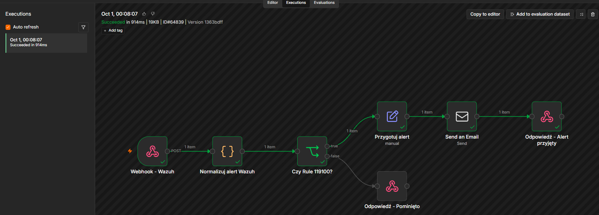
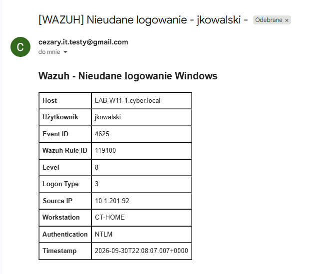
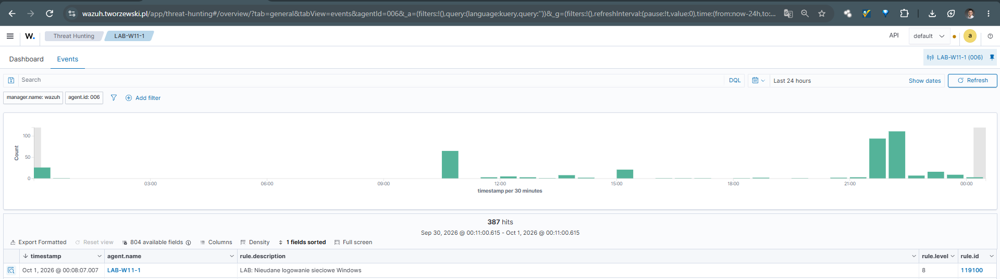

# 04 — Wazuh → n8n → SMTP

## Cel projektu

Celem tego etapu było zbudowanie automatycznej reakcji na wykrycie przez Wazuh konkretnego zdarzenia bezpieczeństwa.

Scenariusz został oparty na własnej regule Wazuh:

- **Rule ID:** `119100`
- **Event ID:** `4625`
- **Logon Type:** `3`
- **Host docelowy:** `LAB-W11-1`
- **Użytkownik:** `CYBER\\jkowalski`
- **Workstation:** `CT-HOME`
- **Source IP:** `10.1.201.92`
- **Authentication:** `NTLM`

Wazuh wykrywa zdarzenie, wysyła alert przez webhook do n8n, a n8n przygotowuje i wysyła powiadomienie e-mail przez SMTP.

---

## 1. Architektura przepływu

```text
Windows / Event ID 4625
          │
          ▼
Wazuh default rule 60122
          │
          ▼
Custom rule 119100
          │
          ▼
Webhook - Wazuh
          │
          ▼
Normalizuj alert Wazuh
          │
          ▼
Czy Rule 119100?
       ┌──┴──┐
     TRUE   FALSE
       │      │
       ▼      ▼
Przygotuj   Odpowiedź -
alert       Pominięto
       │
       ▼
Send an Email
       │
       ▼
Odpowiedź - Alert przyjęty
```

---

## 2. Workflow n8n

Workflow zawiera następujące elementy:

1. **Webhook - Wazuh** — odbiera alert z Wazuh.
2. **Normalizuj alert Wazuh** — wyciąga najważniejsze pola z JSON-a.
3. **Czy Rule 119100?** — przepuszcza dalej tylko alert dotyczący własnej reguły.
4. **Przygotuj alert** — tworzy dane potrzebne do wiadomości.
5. **Send an Email** — wysyła alert przez SMTP.
6. **Odpowiedź - Alert przyjęty** — kończy ścieżkę TRUE.
7. **Odpowiedź - Pominięto** — obsługuje pozostałe alerty.

### Screenshot — workflow



Na zrzucie widać zakończone sukcesem wykonanie workflow oraz osobny node **Send an Email** pomiędzy przygotowaniem alertu i odpowiedzią webhooka.

---

## 3. Dane przekazywane do n8n

W normalizacji wykorzystane zostały dane pochodzące z alertu Windows/Wazuh.

Najważniejsze pola:

```text
agent.name
agent.ip
data.win.system.eventID
data.win.eventdata.targetUserName
data.win.eventdata.targetDomainName
data.win.eventdata.logonType
data.win.eventdata.ipAddress
data.win.eventdata.workstationName
data.win.eventdata.authenticationPackageName
timestamp
rule.id
rule.level
```

Szczególnie istotne jest źródłowe IP:

```text
data.win.eventdata.ipAddress
```

W końcowym teście Wazuh przekazał:

```text
10.1.201.92
```

czyli IPv4 komputera źródłowego `CT-HOME`.

---

## 4. Warunek Rule ID

Node **Czy Rule 119100?** sprawdza:

```text
rule_id == 119100
```

Dzięki temu n8n nie wysyła wiadomości dla każdego zdarzenia dostarczanego przez Wazuh.

Logika:

```text
Rule 119100
    │
    ├── TRUE  → przygotowanie alertu → SMTP
    │
    └── FALSE → pominięcie
```

---

## 5. Przygotowanie alertu

Node **Przygotuj alert** tworzy czytelny zestaw danych:

```text
status
summary
rule_id
rule_level
event_id
target_user
target_domain
logon_type
source_ip
workstation
computer
authentication_package
timestamp
```

Przykładowy alert:

```text
status: ALERT
summary: Nieudane logowanie Windows: CYBER\jkowalski na LAB-W11-1
rule_id: 119100
rule_level: 8
event_id: 4625
target_user: jkowalski
target_domain: CYBER
logon_type: 3
source_ip: 10.1.201.92
workstation: CT-HOME
authentication_package: NTLM
```

---

## 6. SMTP — wysłanie wiadomości

Za node'em **Przygotuj alert** dodany został:

```text
Send an Email
```

Node korzysta z konfiguracji SMTP i wysyła wiadomość do wskazanego odbiorcy.

Schemat:

```text
Przygotuj alert
       │
       ▼
Send an Email
       │
       ▼
Odpowiedź - Alert przyjęty
```

SMTP jest więc końcowym mechanizmem dostarczenia powiadomienia poza samo środowisko Wazuh/n8n.

---

## 7. Końcowy alert e-mail

Wiadomość zawiera najważniejsze informacje potrzebne do szybkiej analizy:

| Pole | Wartość testowa |
|---|---|
| Host | `LAB-W11-1.cyber.local` |
| Użytkownik | `jkowalski` |
| Event ID | `4625` |
| Wazuh Rule ID | `119100` |
| Level | `8` |
| Logon Type | `3` |
| Source IP | `10.1.201.92` |
| Workstation | `CT-HOME` |
| Authentication | `NTLM` |
| Timestamp | `2026-09-30T22:08:07.007+0000` |

### Screenshot — finalny alert SMTP



Na wiadomości widoczne są dane z alertu, w tym rzeczywisty IPv4 źródłowego komputera `10.1.201.92`.

---

## 8. Potwierdzenie po stronie Wazuh

Po wykonaniu testu zdarzenie zostało zarejestrowane w Wazuh jako:

```text
Rule ID: 119100
Level: 8
Description: LAB: Nieudane logowanie sieciowe Windows
Agent: LAB-W11-1
```

### Screenshot — Wazuh



---

## 9. Rezultat testu

Test potwierdził działanie całego łańcucha:

```text
Windows
  ↓
Event ID 4625
  ↓
Wazuh Rule 60122
  ↓
Custom Rule 119100
  ↓
Webhook
  ↓
n8n
  ↓
Filter Rule 119100
  ↓
Prepare Alert
  ↓
SMTP
  ↓
E-mail
```

Oznacza to, że pojedyncze zdarzenie bezpieczeństwa może zostać automatycznie przekształcone w czytelne powiadomienie bez ręcznego sprawdzania konsoli Wazuh.

---

## 10. Wnioski

Projekt pokazał integrację trzech warstw:

### Wazuh

Odpowiada za:

- zbieranie zdarzeń Windows,
- analizę logów,
- zastosowanie własnej reguły `119100`,
- wygenerowanie alertu.

### n8n

Odpowiada za:

- odebranie webhooka,
- normalizację danych,
- filtrowanie po `Rule ID`,
- przygotowanie treści alertu,
- przekazanie wiadomości do SMTP.

### SMTP

Odpowiada za:

- dostarczenie gotowego powiadomienia e-mail.

---

## 11. Następny etap — wielokrotne logowania i Ollama

Kolejnym etapem projektu będzie rozszerzenie detekcji z pojedynczego nieudanego logowania do **wielokrotnych nieudanych prób logowania w określonym czasie**.

Przykładowa logika:

```text
1 × 4625 → rejestracja zdarzenia
2 × 4625 → obserwacja
3+ × 4625 w krótkim czasie
        ↓
  podwyższony alert
        ↓
       n8n
        ↓
     Ollama
        ↓
 analiza / podsumowanie
        ↓
      SMTP
```

W kolejnym etapie do przepływu zostanie dodany **Ollama działający lokalnie w środowisku laboratoryjnym**. Model będzie wykorzystywany do analizy i podsumowania alertu przygotowanego przez n8n, np. wskazania liczby prób, użytkownika, hosta źródłowego, adresu IP oraz podstawowego kontekstu zdarzenia.

Celem będzie zbudowanie bardziej rozbudowanego przepływu:

```text
Windows
   ↓
Wazuh
   ↓
Custom Rule / korelacja
   ↓
n8n
   ↓
Ollama — analiza alertu
   ↓
SMTP
   ↓
Czytelne powiadomienie
```

Dzięki temu projekt przejdzie od prostego powiadomienia o pojedynczym zdarzeniu do **korelacji wielu zdarzeń oraz automatycznego wzbogacania alertu przez lokalny model AI**.
