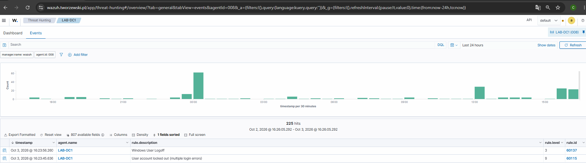
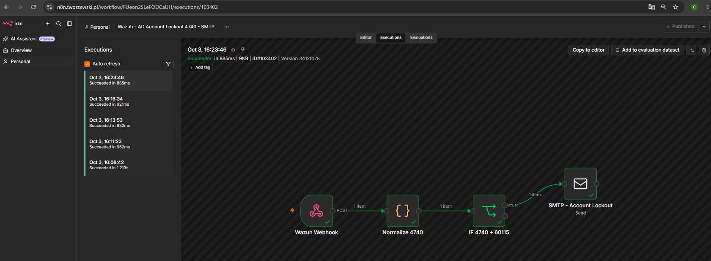
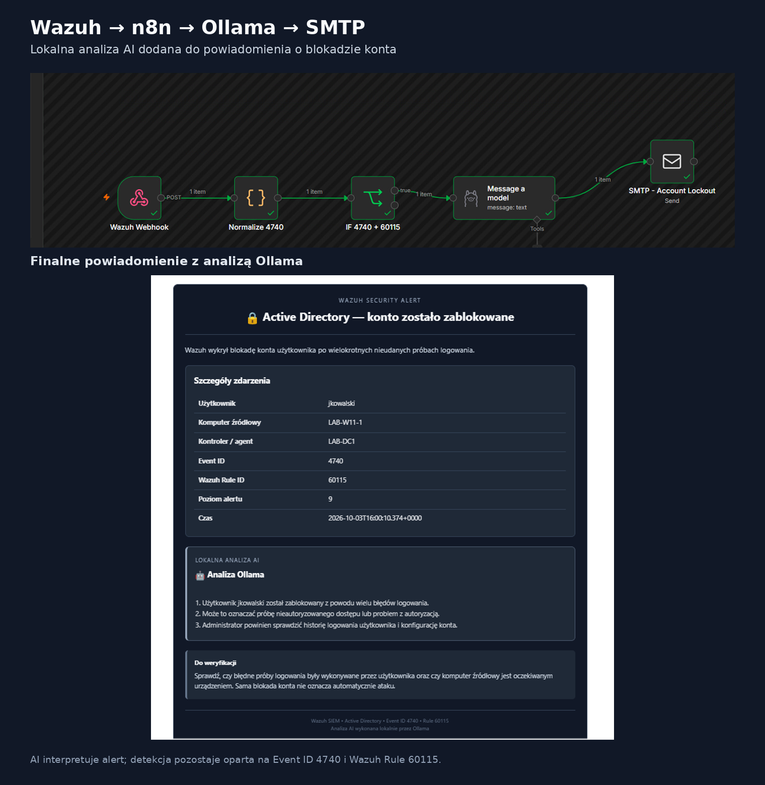

# 05 --- Active Directory Account Lockout: Wazuh + n8n + Ollama

## Cel projektu

Celem projektu było zbudowanie kompletnego przepływu wykrywania blokady
konta Active Directory w środowisku LAB:

``` text
Windows / Active Directory
        ↓
Wazuh
        ↓
n8n
        ↓
Ollama
        ↓
SMTP
```

Projekt obejmuje konfigurację polityki blokady konta, wygenerowanie
kontrolowanego zdarzenia, analizę Windows Security Log, detekcję w
Wazuh, automatyzację n8n, lokalną analizę AI oraz powiadomienie e-mail.

> **Status:** etap podstawowy ukończony. Detekcja blokady konta, n8n,
> Ollama i SMTP działają. Zależność `4625 → 4740` została potwierdzona
> na podstawie logów. Automatyczna korelacja tych zdarzeń pozostaje
> możliwym kolejnym etapem rozwoju.

------------------------------------------------------------------------

## Środowisko LAB

  Element                      Wartość
  ---------------------------- ---------------
  Domena                       `cyber.local`
  NetBIOS                      `CYBER`
  Kontroler domeny             `LAB-DC1`
  Stacja robocza               `LAB-W11-1`
  Użytkownik testowy           `jkowalski`
  Wazuh Manager                Wazuh 4.14.8
  Automatyzacja                n8n
  Analiza lokalna              Ollama
  Event nieudanego logowania   `4625`
  Event blokady konta          `4740`
  Wazuh Rule ID                `60115`
  Wazuh Rule Level             `9`

------------------------------------------------------------------------

## 1. Account Lockout Policy

Na potrzeby kontrolowanego testu ustawiono w domenie:

``` text
Account lockout threshold: 2
Account lockout duration: 10 minutes
Reset account lockout counter after: 10 minutes
```

Próg `2` jest ustawieniem laboratoryjnym, które pozwala szybko i
powtarzalnie wygenerować blokadę konta.


------------------------------------------------------------------------

## 2. Test blokady konta

Na `LAB-W11-1` wykonano dwie nieudane próby logowania na istniejące
konto:

``` text
CYBER\jkowalski
```

Po osiągnięciu skonfigurowanego progu konto zostało zablokowane.


------------------------------------------------------------------------

## 3. Zdarzenia źródłowe Windows

### Event ID 4625 --- nieudane logowanie

Na `LAB-W11-1` Windows Security Log zarejestrował nieudane próby
logowania użytkownika `jkowalski` jako Event ID `4625`.

W kontrolowanym teście były to dwa zdarzenia poprzedzające blokadę
konta.


### Event ID 4740 --- blokada konta

Po osiągnięciu progu blokady kontroler domeny `LAB-DC1` zarejestrował
Event ID `4740`:

``` text
A user account was locked out.

Account Name:         jkowalski
Caller Computer Name: LAB-W11-1
Computer:             LAB-DC1.cyber.local
```

`Caller Computer Name` wskazuje stację związaną z próbami
uwierzytelnienia prowadzącymi do blokady.


------------------------------------------------------------------------

## 4. Detekcja w Wazuh

Wazuh odebrał zdarzenie `4740` z agenta `LAB-DC1`.

Nie było potrzeby tworzenia własnej reguły dla samej blokady konta.
Zdarzenie zostało wykryte przez wbudowaną regułę:

``` text
Rule ID:     60115
Level:       9
Description: User account locked out (multiple login errors)
```



Szczegóły alertu w Wazuh potwierdzają zdarzenie `4740` oraz dane konta i
komputera.


------------------------------------------------------------------------

## 5. CIS / Security Configuration Assessment

Wazuh SCA wykorzystano jako dodatkową kontrolę konfiguracji Account
Lockout Threshold.

Przy niezerowym progu test SCA dla tego ustawienia przechodzi jako
`passed`.


SCA jest w tym projekcie dodatkowym elementem kontroli konfiguracji. Nie
zastępuje testu działania polityki domenowej.

------------------------------------------------------------------------

## 6. Potwierdzenie zależności 4625 → 4740

Podczas kontrolowanego testu zaobserwowano:

``` text
LAB-W11-1
   │
   ├── Event 4625 → Logon Failure → jkowalski
   ├── Event 4625 → Logon Failure → jkowalski
   │
   ▼
Active Directory Account Lockout Policy
   │
   ▼
LAB-DC1
   │
   └── Event 4740 → Account Locked → jkowalski
                    Caller Computer: LAB-W11-1
```

W Wazuh zdarzenia były widoczne na dwóch agentach: `LAB-W11-1` dla
nieudanych logowań oraz `LAB-DC1` dla blokady konta.


**Ważne:** na tym etapie zależność została potwierdzona na podstawie
danych i osi czasu. Workflow n8n nie wykonuje jeszcze automatycznego
łączenia wcześniejszych `4625` z późniejszym `4740`.

------------------------------------------------------------------------

## 7. Integracja Wazuh → n8n

Alert Wazuh Rule ID `60115` jest przekazywany do dedykowanego webhooka
n8n.

Przykład konfiguracji integracji:

``` xml
<integration>
  <name>custom-n8n-failed-logon</name>
  <hook_url>https://n8n.tworzewski.pl/webhook/wazuh-ad-account-lockout</hook_url>
  <rule_id>60115</rule_id>
  <alert_format>json</alert_format>
</integration>
```

Workflow:

``` text
Wazuh Webhook
      ↓
Normalize 4740
      ↓
IF 4740 + 60115
      ↓
Message a model / Ollama
      ↓
SMTP - Account Lockout
```



------------------------------------------------------------------------

## 8. Lokalna analiza AI --- Ollama

Workflow został rozszerzony o lokalny model uruchomiony przez Ollama.

Model otrzymuje kontekst alertu i generuje krótką analizę dla
administratora:

1.  co się wydarzyło,
2.  dlaczego zdarzenie może być istotne,
3.  co administrator powinien zweryfikować.

Przykładowa zasada promptu:

``` text
Nie oceniaj zdarzenia jako atak bez wystarczających dowodów.
Opisz krótko zdarzenie, jego znaczenie i zalecane sprawdzenia.
```

Ollama **nie odpowiada za detekcję ani blokowanie konta**. Detekcja
pozostaje oparta na Windows Event ID `4740` i Wazuh Rule ID `60115`. AI
pełni rolę pomocniczą przy interpretacji alertu.



------------------------------------------------------------------------

## 9. Finalne powiadomienie SMTP

Finalny e-mail zawiera m.in.:

``` text
Użytkownik:       jkowalski
Komputer źródłowy: LAB-W11-1
Kontroler / agent: LAB-DC1
Event ID:          4740
Wazuh Rule ID:     60115
Poziom alertu:     9
```

Dodatkowo wiadomość zawiera sekcję **Lokalna analiza AI / Analiza
Ollama** oraz informację, że sama blokada konta nie oznacza
automatycznie ataku.


------------------------------------------------------------------------

## 10. Dlaczego 4625 nie zawsze oznacza blokadę?

Event ID `4625` oznacza nieudane logowanie, ale nie każda taka próba
prowadzi do blokady.

Przykładowo zdarzenie może dotyczyć:

-   błędnego hasła,
-   nieistniejącej nazwy użytkownika,
-   zapisanych starych poświadczeń,
-   usługi lub zadania korzystającego ze starego hasła.

Event ID `4740` oznacza natomiast, że istniejące konto zostało
faktycznie zablokowane przez Active Directory.

Dlatego:

``` text
4625 ≠ automatycznie 4740
```

------------------------------------------------------------------------

## 11. Co zostało wykonane

-   [x] konfiguracja Account Lockout Policy,
-   [x] kontrolowany test blokady konta,
-   [x] analiza Windows Event ID `4625`,
-   [x] analiza Windows Event ID `4740`,
-   [x] detekcja blokady przez Wazuh Rule `60115`,
-   [x] dodatkowa weryfikacja konfiguracji przez Wazuh SCA,
-   [x] przekazanie alertu Wazuh do n8n,
-   [x] normalizacja danych `4740`,
-   [x] filtrowanie `4740 + 60115`,
-   [x] lokalna analiza przez Ollama,
-   [x] finalne powiadomienie SMTP,
-   [x] ręczne potwierdzenie zależności `4625 → 4740`.

------------------------------------------------------------------------

## 12. Możliwe dalsze rozwinięcie

Obecna wersja projektu jest zakończonym, działającym scenariuszem
detekcji i powiadamiania.

Opcjonalnym kolejnym etapem może być **automatyczna korelacja**. Po
otrzymaniu `4740` n8n lub warstwa korelacyjna mogłaby odnaleźć
wcześniejsze `4625` dla tego samego użytkownika i komputera, a następnie
utworzyć jeden wzbogacony incydent.

Przykład docelowego kontekstu:

``` text
Użytkownik:             jkowalski
Komputer:               LAB-W11-1
Nieudane logowania:     2
Event źródłowy:         4625
Event blokady:          4740
Agent 4625:             LAB-W11-1
Agent 4740:             LAB-DC1
Status:                 KONTO ZABLOKOWANE
```

Nie jest to wymagane do działania obecnego rozwiązania.

------------------------------------------------------------------------

## 13. Czego projekt uczy / co pokazuje

Projekt pokazuje praktyczną pracę z:

-   Active Directory i Group Policy,
-   Windows Security Event Log,
-   Event ID `4625` i `4740`,
-   Wazuh SIEM,
-   Wazuh SCA,
-   analizą zdarzeń pochodzących z różnych hostów,
-   integracją webhook,
-   n8n,
-   przetwarzaniem JSON,
-   SMTP,
-   lokalnym modelem Ollama,
-   wykorzystaniem AI jako warstwy wspomagającej analizę bezpieczeństwa,
-   dokumentowaniem i testowaniem kompletnego przepływu alertu.

------------------------------------------------------------------------

## Podsumowanie

Projekt realizuje działający przepływ:

``` text
Nieudane logowanie
      ↓
Windows Security Log
      ↓
Active Directory blokuje konto
      ↓
Event ID 4740
      ↓
Wazuh Rule 60115
      ↓
n8n
      ↓
Ollama
      ↓
SMTP
      ↓
Administrator otrzymuje alert
```

Etap podstawowy projektu został ukończony. Automatyczna korelacja
`4625 → 4740` może zostać dodana w przyszłości jako osobne rozszerzenie.
