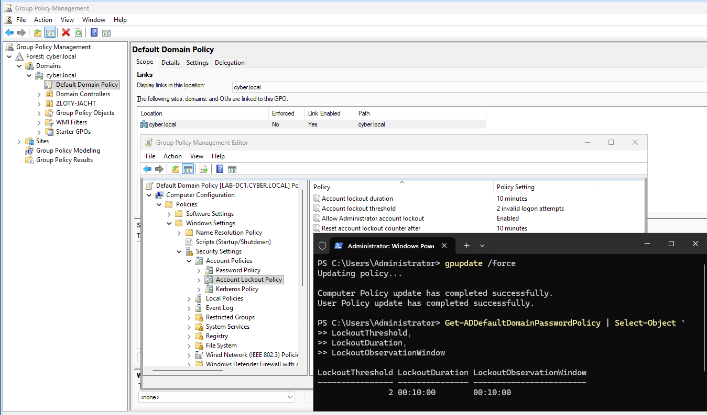
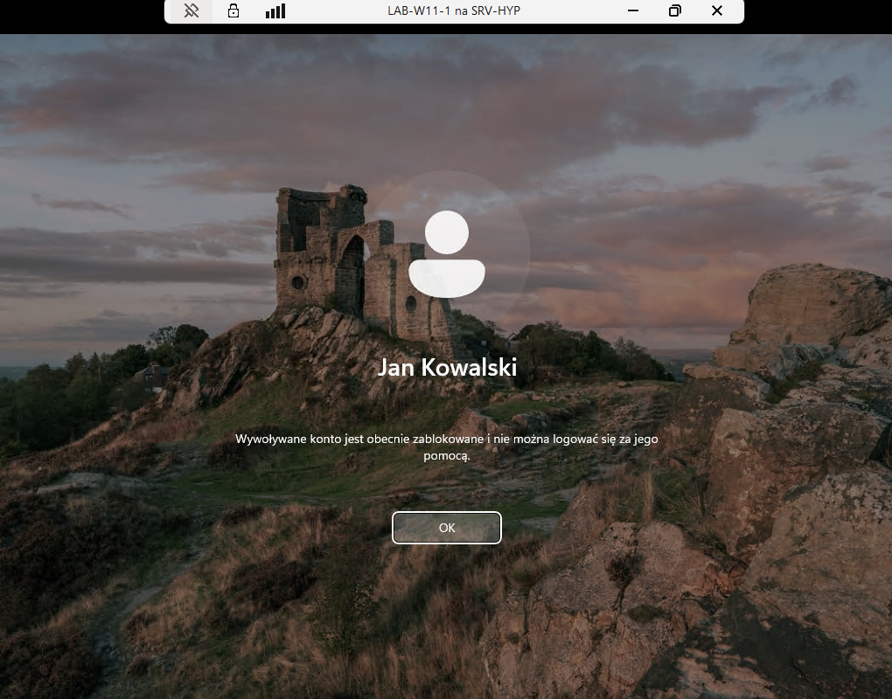
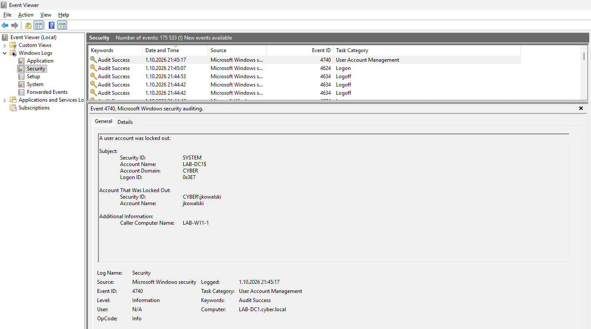
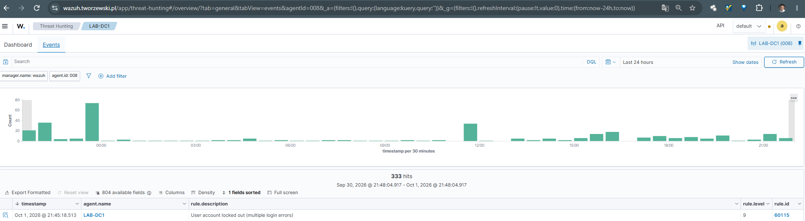
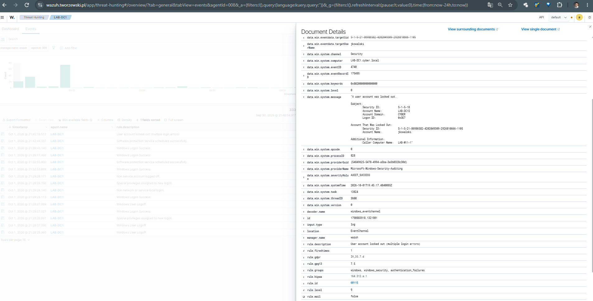
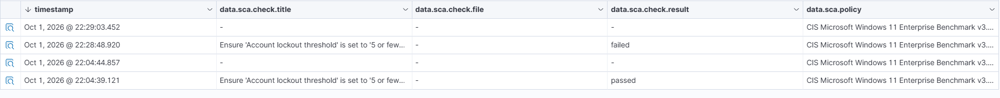

# 05 — Wykrywanie blokady konta Active Directory

## O projekcie

Projekt pokazuje wykrywanie blokady konta użytkownika w Active Directory przy użyciu Wazuh.

Założenie jest proste:

1. Active Directory blokuje konto po określonej liczbie błędnych prób logowania.
2. Kontroler domeny zapisuje zdarzenie Windows **Event ID 4740**.
3. Wazuh wykrywa zdarzenie i generuje alert **Rule ID 60115**.
4. W kolejnym etapie alert zostanie przekazany do n8n i wysłany e-mailem do administratora.

Na tym etapie nie używamy Active Response — blokada jest wykonywana przez politykę Active Directory.

---

## Środowisko testowe

- domena: `cyber.local`
- kontroler domeny: `LAB-DC1`
- stacja testowa: `LAB-W11-1`
- konto testowe: `jkowalski`
- Wazuh Agent na kontrolerze domeny

---

## 1. Konfiguracja Account Lockout Policy

W `Default Domain Policy` skonfigurowano politykę blokady konta:

- **Account lockout threshold:** 2 nieudane próby logowania
- **Account lockout duration:** 10 minut
- **Reset account lockout counter after:** 10 minut
- **Allow Administrator account lockout:** Enabled

Po zmianie polityki wykonano:

```powershell
gpupdate /force
```

Następnie konfigurację zweryfikowano za pomocą PowerShell:

```powershell
Get-ADDefaultDomainPasswordPolicy | Select-Object `
LockoutThreshold,
LockoutDuration,
LockoutObservationWindow
```

Wynik potwierdził wartości `2 / 10 min / 10 min`.



---

## 2. Test blokady konta

Na stacji `LAB-W11-1` wykonano dwie celowo nieudane próby logowania do konta domenowego `CYBER\jkowalski`.

Po przekroczeniu ustawionego progu Active Directory automatycznie zablokowało konto.



---

## 3. Event ID 4740 na kontrolerze domeny

Na `LAB-DC1` w dzienniku `Windows Logs -> Security` pojawiło się zdarzenie:

- **Event ID:** `4740`
- **Account Name:** `jkowalski`
- **Caller Computer Name:** `LAB-W11-1`
- komunikat: `A user account was locked out.`

Pole `Caller Computer Name` pozwala ustalić komputer, z którego pochodziła próba prowadząca do blokady konta.



---

## 4. Detekcja zdarzenia przez Wazuh

Wazuh odebrał zdarzenie z agenta `LAB-DC1` i wykorzystał istniejącą regułę:

- **Windows Event ID:** `4740`
- **Wazuh Rule ID:** `60115`
- **Rule level:** `9`
- **Description:** `User account locked out (multiple login errors)`

Nie ma potrzeby tworzenia własnej reguły tylko do podstawowego wykrywania 4740 — domyślna reguła Wazuh poprawnie obsługuje to zdarzenie.



W szczegółach alertu Wazuh widoczne są dane pochodzące bezpośrednio ze zdarzenia Windows, m.in. konto `jkowalski`, `Event ID 4740` oraz `Caller Computer Name: LAB-W11-1`.



---

## Aktualny przepływ

```text
2 x błędne logowanie na LAB-W11-1
              ↓
     Active Directory
              ↓
      blokada jkowalski
              ↓
 Windows Security Event ID 4740
              ↓
       Wazuh LAB-DC1
              ↓
 Rule ID 60115 / Level 9
```

---

## Plan projektu

- [x] Sprawdzić politykę blokady konta w Active Directory
- [x] Skonfigurować testowo próg 2 błędnych logowań
- [x] Zweryfikować konfigurację GPO za pomocą PowerShell
- [x] Wygenerować testową blokadę konta użytkownika
- [x] Potwierdzić Event ID 4740 na kontrolerze domeny
- [x] Sprawdzić, czy Wazuh odbiera zdarzenie 4740
- [x] Zidentyfikować domyślną regułę Wazuh 60115
- [x] Potwierdzić nazwę zablokowanego użytkownika i komputer źródłowy
- [ ] Wysłać alert z Wazuh do n8n
- [ ] Przygotować czytelny e-mail dla administratora
- [ ] Przetestować cały przepływ Wazuh -> n8n -> SMTP
- [ ] Uzupełnić końcowe podsumowanie projektu

---

## Docelowy przepływ

```text
Błędne logowania
      ↓
Active Directory
      ↓
Event ID 4740
      ↓
Wazuh / Rule 60115
      ↓
n8n
      ↓
E-mail do administratora
```

## Weryfikacja zgodności z CIS Benchmark

Wazuh Security Configuration Assessment (SCA) weryfikuje ustawienie `Account lockout threshold` zgodnie z CIS Benchmark. Ustawienie wartości `2` otrzymało status **passed**, natomiast po zmianie na `0` kontrola została oznaczona jako **failed**, ponieważ blokada kont została wyłączona.


Źródło: [CIS Password Policy Guide](https://www.cisecurity.org/insights/white-papers/cis-password-policy-guide)

