# 06 – Wykrywanie logowań na konta uprzywilejowane w Active Directory

## Cel projektu

Celem projektu jest zbudowanie wieloetapowej detekcji aktywności konta uprzywilejowanego w środowisku Active Directory.

Projekt ma docelowo odpowiedzieć na pytania:

1. **Czy konto uprzywilejowane zostało użyte do logowania?**
2. **Czy po logowaniu uruchomiono PowerShell?**
3. **Jakie polecenia lub skrypty zostały wykonane?**
4. **Czy kilka niezależnych zdarzeń można połączyć w jeden czytelny incydent?**

Docelowy przepływ:

```text
Privileged Account Logon
        ↓
Windows Security 4624 / 4672
        ↓
Wazuh
        ↓
Sysmon – Process Create
        ↓
PowerShell Script Block Logging – 4104
        ↓
własne reguły Wazuh
        ↓
n8n
        ↓
jeden skorelowany alert SMTP
```

Projekt jest wykonywany w środowisku LAB i służy do nauki analizy zdarzeń Windows, Sysmon, PowerShell Script Block Logging, korelacji, Detection Engineering oraz automatyzacji obsługi alertów.

---

## Środowisko LAB

| Element | Rola |
|---|---|
| `LAB-DC1` | Active Directory / domena `cyber.local` |
| `LAB-W11-1` | stacja testowa Windows 11 |
| `CYBER\adm-ctworzewski` | testowe konto uprzywilejowane |
| Wazuh Agent | zbieranie logów ze stacji |
| Wazuh Manager | analiza zdarzeń i własne reguły |
| Sysmon | telemetria procesów |
| PowerShell Script Block Logging | zapis wykonywanego kodu PowerShell |

---

# Etap 1 – logowanie konta uprzywilejowanego

Pierwszym etapem projektu jest sprawdzenie, jakie zdarzenia generuje Windows podczas użycia konta uprzywilejowanego oraz czy ten sam kontekst jest widoczny w Wazuh.

Analizowane zdarzenia:

- **4624** – udane logowanie,
- **4672** – przypisanie specjalnych uprawnień do nowej sesji.

## Event ID 4624 – udane logowanie

Po zalogowaniu konta:

```text
CYBER\adm-ctworzewski
```

Windows zarejestrował Event ID `4624`.

Na potrzeby korelacji interesujące są przede wszystkim:

- `Account Name`,
- `Account Domain`,
- `Logon Type`,
- `Logon ID`,
- `Linked Logon ID`.

W badanym zdarzeniu:

```text
Account Name: adm-ctworzewski
Domain: CYBER
Logon Type: 7
Logon ID: 0x38BF8E
Linked Logon ID: 0x38BD57
```

> `Logon Type 7` oznacza odblokowanie istniejącej sesji. W dalszej części projektu ten typ będzie celowo wyłączony z właściwej detekcji logowania uprzywilejowanego.

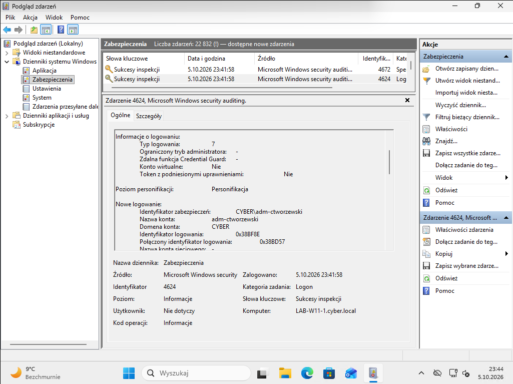

## Event ID 4672 – specjalne uprawnienia

W tej samej sekwencji Windows wygenerował Event ID `4672`:

```text
Account Name: adm-ctworzewski
Domain: CYBER
Logon ID: 0x38BD57
```

Zdarzenie potwierdza przypisanie do sesji specjalnych uprawnień.

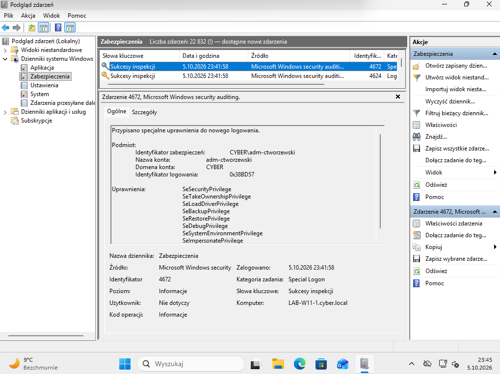

## Korelacja 4624 → 4672 po Logon ID

W `4624`:

```text
Linked Logon ID: 0x38BD57
```

W `4672`:

```text
Logon ID: 0x38BD57
```

Daje to zależność:

```text
4624
Linked Logon ID: 0x38BD57
        ↓
4672
Logon ID: 0x38BD57
```

---

# Windows → Wazuh

Wazuh odebrał ten sam Event ID `4672` wraz z kluczowym kontekstem:

```text
agent.name = LAB-W11-1
eventID = 4672
subjectDomainName = CYBER
subjectUserName = adm-ctworzewski
subjectLogonId = 0x38bd57
```

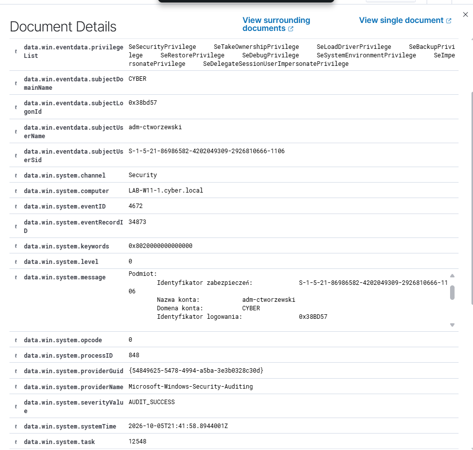

Domyślna klasyfikacja Wazuh:

```text
Rule ID: 67028
Level: 3
Description: Special privileges assigned to new logon.
```

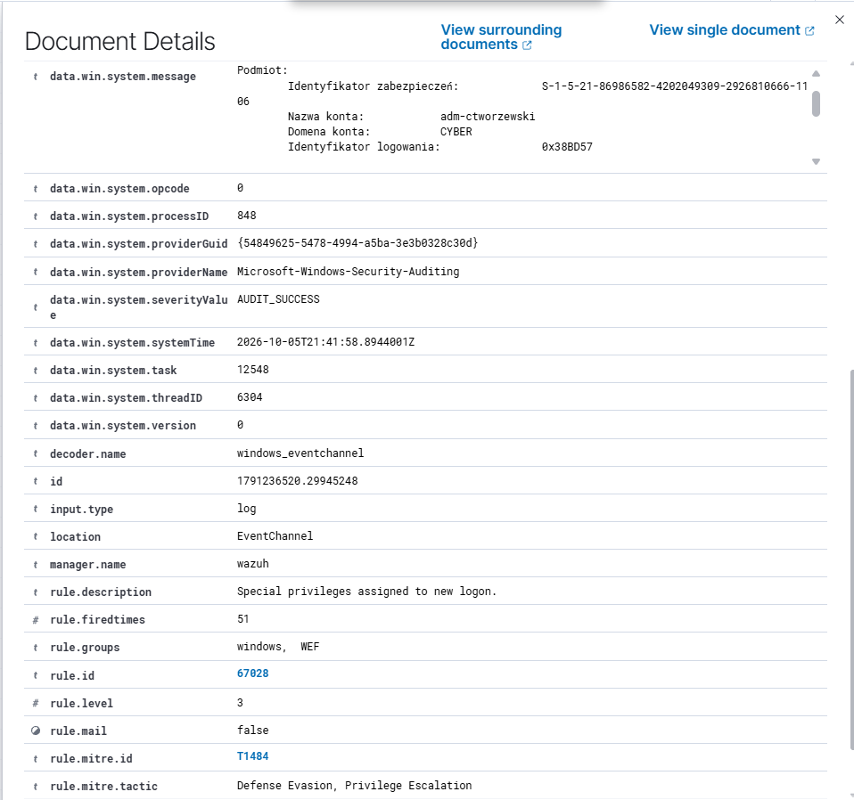

## Co potwierdzono w Etapie 1

- [x] Windows generuje `4624`,
- [x] Windows generuje `4672`,
- [x] możliwa jest korelacja po `Logon ID`,
- [x] Wazuh odbiera `4672`,
- [x] Wazuh zachowuje użytkownika, domenę i `Logon ID`,
- [x] domyślna reguła `67028` poprawnie klasyfikuje zdarzenie.

---

# Etap 2 – Sysmon i uruchomienie PowerShell

Drugim etapem jest rozszerzenie telemetrii o Sysmon i sprawdzenie, czy po użyciu konta uprzywilejowanego można wykryć uruchomienie PowerShell.

Najważniejsze zdarzenie:

```text
Sysmon Event ID 1 – Process Create
```

## Sysmon – lokalny Event ID 1

Po uruchomieniu PowerShell przez:

```text
CYBER\adm-ctworzewski
```

Sysmon zarejestrował:

```text
Event ID: 1
Image: C:\Windows\System32\WindowsPowerShell\v1.0\powershell.exe
User: CYBER\adm-ctworzewski
ProcessId: 9900
LogonId: 0x950c3
IntegrityLevel: High
```

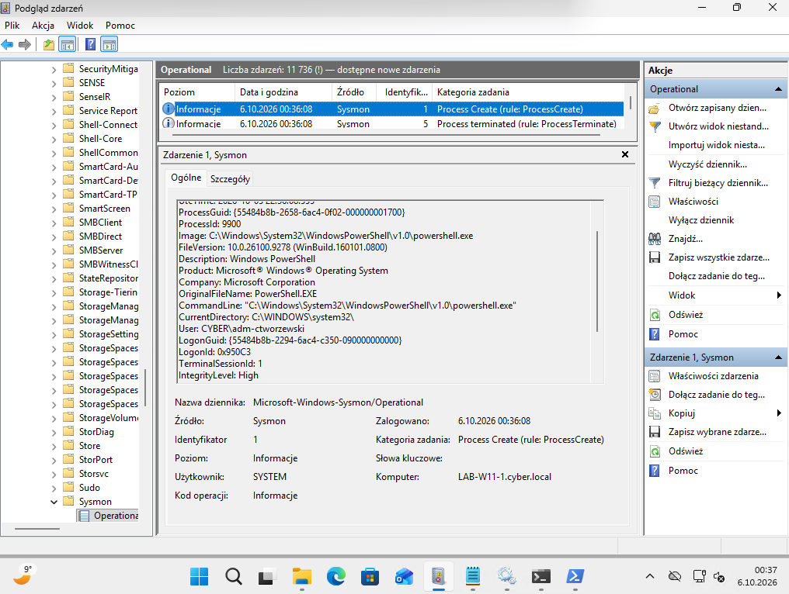

## Sysmon → Wazuh

Do konfiguracji agenta Wazuh dodano kanał:

```xml
<localfile>
  <location>Microsoft-Windows-Sysmon/Operational</location>
  <log_format>eventchannel</log_format>
</localfile>
```

Po restarcie agenta Wazuh odebrał ten sam proces:

```text
agent.name = LAB-W11-1
image = C:\Windows\System32\WindowsPowerShell\v1.0\powershell.exe
processId = 9900
logonId = 0x950c3
integrityLevel = High
```

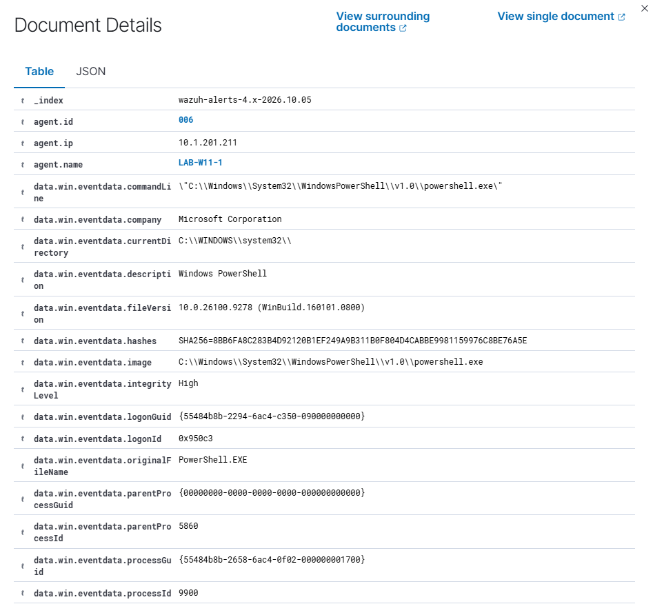

Zdarzenie zostało sklasyfikowane przez:

```text
Rule ID: 100100
Level: 3
Description: Sysmon - Event 1: Process creation Windows PowerShell
```

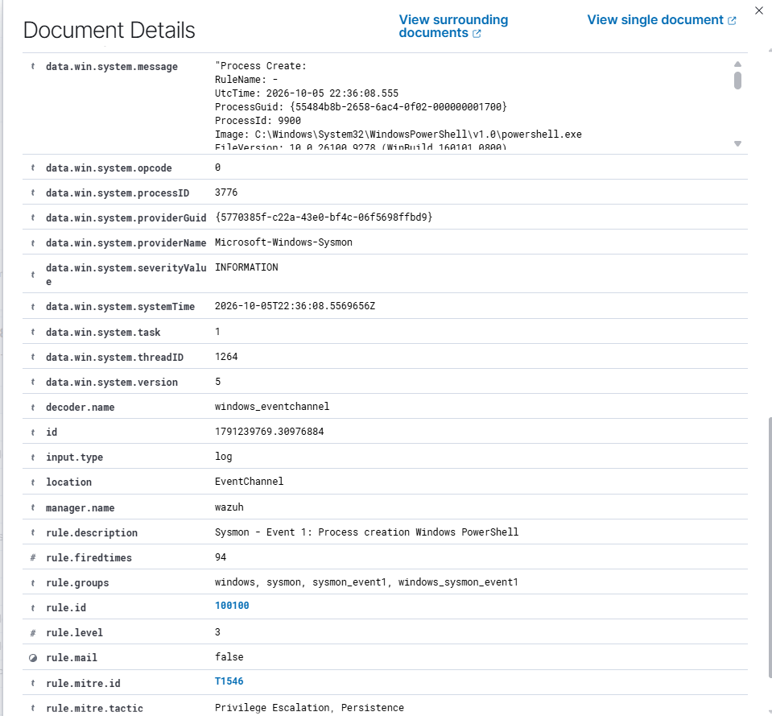

## Co potwierdzono w Etapie 2

- [x] Sysmon działa na `LAB-W11-1`,
- [x] Sysmon generuje Event ID `1`,
- [x] wykrywane jest uruchomienie `powershell.exe`,
- [x] widoczny jest użytkownik `CYBER\adm-ctworzewski`,
- [x] widoczny jest `ProcessId`,
- [x] widoczny jest `LogonId`,
- [x] widoczny jest `IntegrityLevel: High`,
- [x] Wazuh odbiera Sysmon Event ID `1`,
- [x] Wazuh klasyfikuje zdarzenie regułą `100100`.

---

# Etap 3 – PowerShell Script Block Logging

Sysmon pokazuje, że uruchomiono proces PowerShell, ale nie daje pełnego obrazu tego, **co zostało wykonane wewnątrz PowerShell**.

Dlatego w kolejnym kroku włączono:

```text
Turn on PowerShell Script Block Logging
```

## Włączenie polityki

W `gpedit.msc`:

```text
Computer Configuration
→ Administrative Templates
→ Windows Components
→ Windows PowerShell
→ Turn on PowerShell Script Block Logging
→ Enabled
```

Następnie wymuszono politykę:

```powershell
gpupdate /force
```

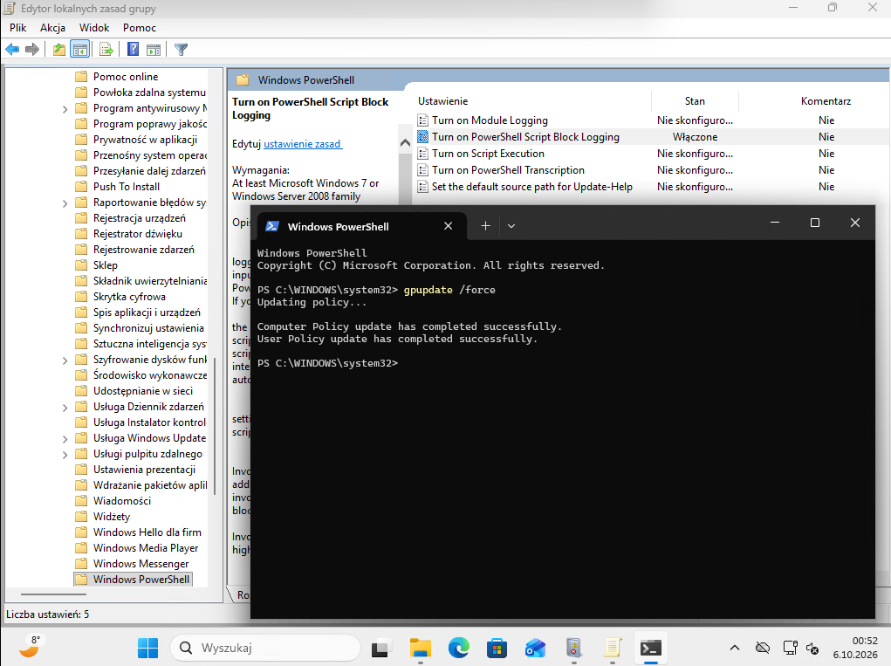

## Test – Get-LocalUser

Po wykonaniu:

```powershell
Get-LocalUser
```

Windows zapisał:

```text
Event ID: 4104
User: CYBER\adm-ctworzewski
ScriptBlockText: Get-LocalUser
ScriptBlock ID: ed11f023-d47c-4ce8-a9ff-d7c823104aec
```

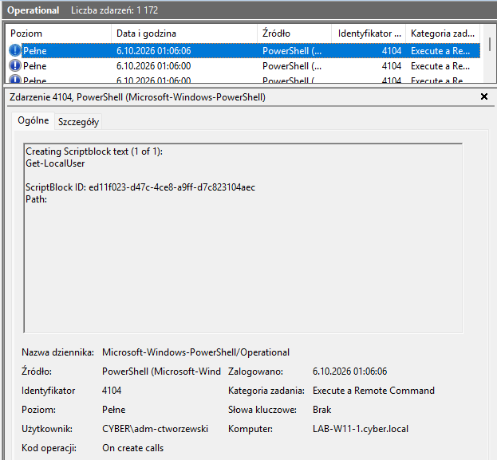

## PowerShell 4104 → Wazuh

Do agenta Wazuh dodano kanał:

```xml
<localfile>
  <location>Microsoft-Windows-PowerShell/Operational</location>
  <log_format>eventchannel</log_format>
</localfile>
```

Po restarcie agenta Wazuh poprawnie odebrał Event ID `4104`.

Widoczne pola:

```text
agent.name = LAB-W11-1
eventID = 4104
channel = Microsoft-Windows-PowerShell/Operational
scriptBlockText = Get-LocalUser
scriptBlockId = ed11f023-d47c-4ce8-a9ff-d7c823104aec
```

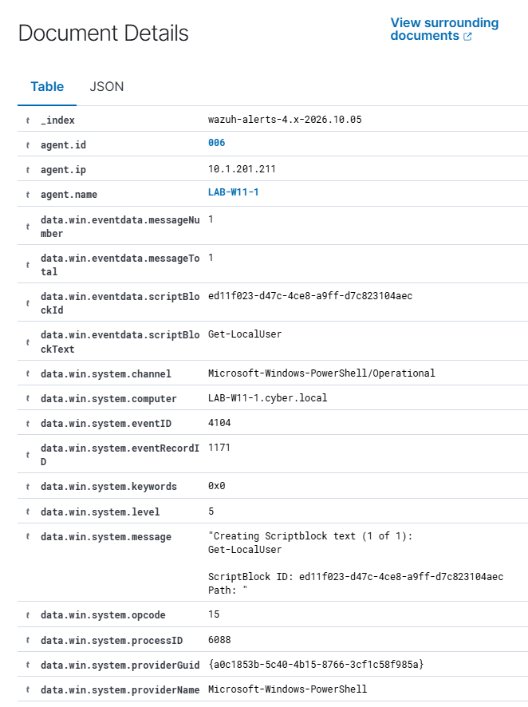

Najważniejsze jest to, że po obu stronach widoczny jest ten sam:

```text
ScriptBlock ID:
ed11f023-d47c-4ce8-a9ff-d7c823104aec
```

czyli możemy jednoznacznie powiązać lokalny wpis Windows z dokumentem odebranym przez Wazuh.

## Reguła i MITRE ATT&CK

Wazuh sklasyfikował wykonanie `Get-LocalUser` jako:

```text
Rule ID: 100541
Level: 3
Description: Powershell script Get-LocalUser Executed
MITRE: T1087.002
Tactic: Discovery
Technique: Domain Account
```

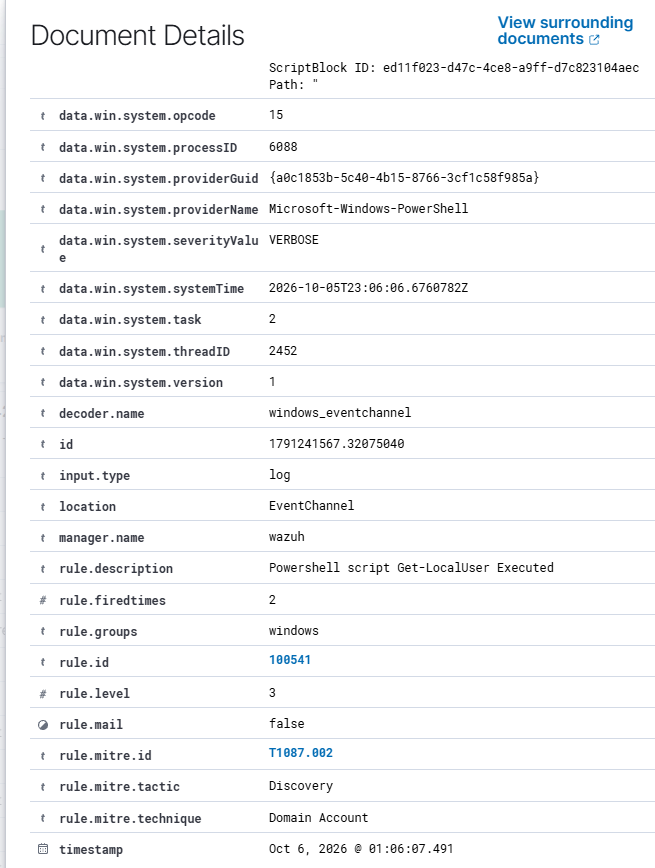

## Co potwierdzono w Etapie 3

- [x] Script Block Logging został włączony,
- [x] polityka została zastosowana przez `gpupdate /force`,
- [x] Windows generuje Event ID `4104`,
- [x] `4104` zawiera `scriptBlockText`,
- [x] `4104` zawiera `ScriptBlock ID`,
- [x] Wazuh odbiera `Microsoft-Windows-PowerShell/Operational`,
- [x] Wazuh zachowuje `scriptBlockText`,
- [x] Windows i Wazuh można powiązać po `ScriptBlock ID`,
- [x] Wazuh klasyfikuje `Get-LocalUser` regułą `100541`,
- [x] Wazuh przypisuje mapowanie MITRE ATT&CK `T1087.002`.

---

# Dlaczego ten etap ma znaczenie

Na tym etapie mamy już trzy różne warstwy widoczności:

```text
Windows Security
→ kto się zalogował?

Sysmon
→ jaki proces został uruchomiony?

PowerShell 4104
→ co zostało wykonane wewnątrz PowerShell?
```

Dzięki temu można zbudować znacznie bardziej wartościową sekwencję:

```text
adm-ctworzewski
        ↓
logowanie konta uprzywilejowanego
        ↓
powershell.exe
        ↓
Get-LocalUser
```

Samo `Get-LocalUser` nie oznacza ataku. Może być normalną czynnością administracyjną. W projekcie chodzi o uzyskanie **pełnego kontekstu**, który później pozwoli zbudować własną detekcję i korelację.

---

# Następny etap

## Etap 4 – własne reguły Wazuh

Kolejnym krokiem będzie utworzenie własnych reguł:

```text
100200 → wykrycie logowania konta uprzywilejowanego
100201 → wykrycie uruchomienia PowerShell
100203 → wykrycie wykonanego ScriptBlock
```

Następnie te trzy źródła zostaną wykorzystane do dalszej korelacji i automatyzacji w n8n.

---

# Status projektu

✅ **Etap 1 – Windows Security / Wazuh**

```text
4624
↓
4672
↓
korelacja po Logon ID
↓
Wazuh Rule 67028
```

✅ **Etap 2 – Sysmon / PowerShell**

```text
powershell.exe
↓
Sysmon Event ID 1
↓
ProcessId / LogonId / IntegrityLevel
↓
Wazuh Rule 100100
```

✅ **Etap 3 – PowerShell Script Block Logging**

```text
Get-LocalUser
↓
Event ID 4104
↓
ScriptBlockText / ScriptBlock ID
↓
Wazuh Rule 100541
↓
MITRE T1087.002
```

🚧 **Następny krok: własne reguły Wazuh `100200 / 100201 / 100203`**
