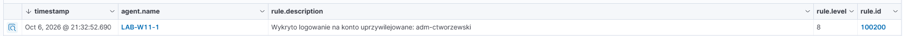
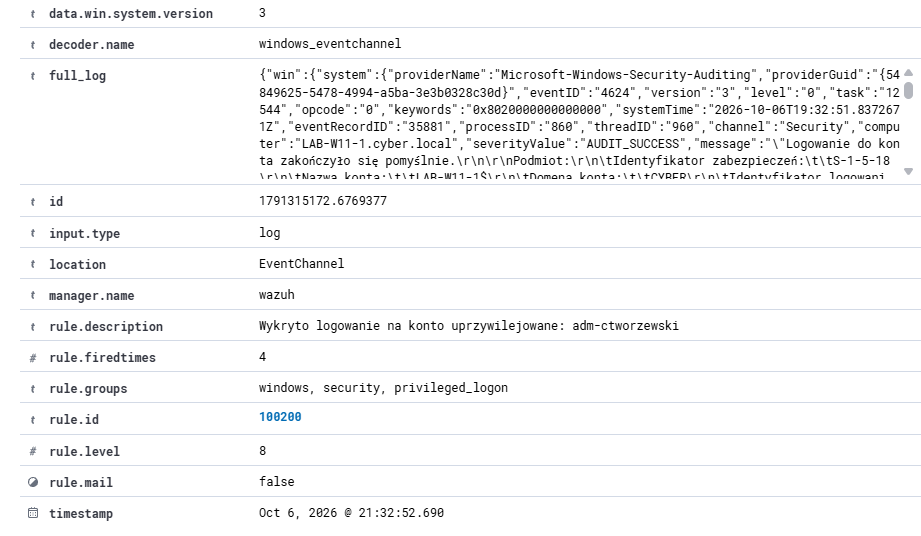
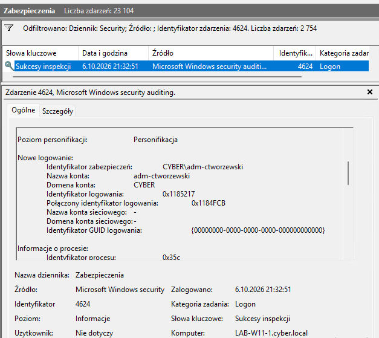
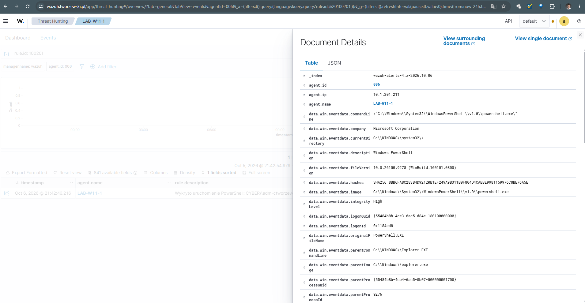
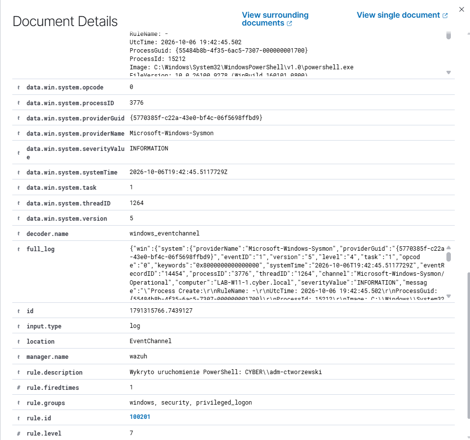
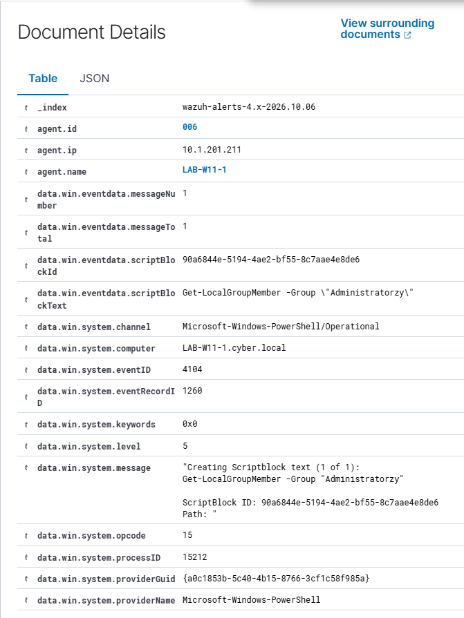
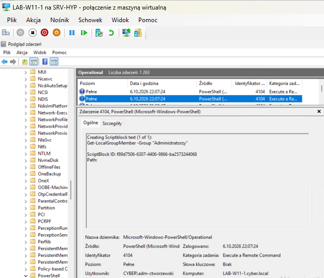
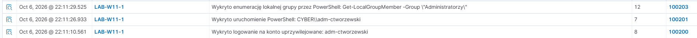

# 06 – Wykrywanie logowań na konta uprzywilejowane w Active Directory

## Cel projektu

Celem projektu jest zbudowanie wieloetapowej detekcji aktywności konta uprzywilejowanego w środowisku Active Directory.

Projekt ma docelowo odpowiedzieć na pytania:

1. **Czy konto uprzywilejowane zostało użyte do logowania?**
2. **Czy po logowaniu uruchomiono PowerShell?**
3. **Jakie polecenie administracyjne lub discovery zostało wykonane?**
4. **Czy kilka niezależnych zdarzeń można połączyć w jeden czytelny incydent?**

Docelowy przepływ:

```text
Privileged Account Logon
        ↓
Windows Security 4624 / 4672
        ↓
Wazuh
        ↓
Sysmon – Process Create
        ↓
PowerShell Script Block Logging – 4104
        ↓
własne reguły Wazuh
        ↓
n8n
        ↓
jeden skorelowany alert SMTP
```

Projekt jest wykonywany w środowisku LAB i służy do nauki analizy zdarzeń Windows, Sysmon, PowerShell Script Block Logging, strojenia reguł Wazuh, korelacji i automatyzacji obsługi alertów.

---

## Środowisko LAB

| Element | Rola |
|---|---|
| `LAB-DC1` | Active Directory / domena `cyber.local` |
| `LAB-W11-1` | stacja testowa Windows 11 |
| `CYBER\adm-ctworzewski` | testowe konto uprzywilejowane |
| Wazuh Agent | zbieranie logów ze stacji |
| Wazuh Manager | analiza zdarzeń i własne reguły |
| Sysmon | telemetria procesów |
| PowerShell Script Block Logging | zapis wykonywanego kodu PowerShell |
| n8n | docelowa korelacja i SMTP |

---

# Etap 1 – logowanie konta uprzywilejowanego

Analizowane zdarzenia:

- **4624** – udane logowanie,
- **4672** – przypisanie specjalnych uprawnień do nowej sesji.

Po zalogowaniu konta `CYBER\adm-ctworzewski` Windows zarejestrował Event ID `4624`.

```text
Account Name: adm-ctworzewski
Domain: CYBER
Logon Type: 7
Logon ID: 0x38BF8E
Linked Logon ID: 0x38BD57
```

> `Logon Type 7` oznacza odblokowanie istniejącej sesji. W późniejszej własnej regule został celowo pominięty.


W tej samej sekwencji Windows wygenerował Event ID `4672`:

```text
Account Name: adm-ctworzewski
Domain: CYBER
Logon ID: 0x38BD57
```


Korelacja:

```text
4624 → Linked Logon ID: 0x38BD57
4672 → Logon ID:        0x38BD57
```

Wazuh odebrał ten sam Event ID `4672` wraz z użytkownikiem, domeną i `subjectLogonId`.


Domyślna klasyfikacja:

```text
Rule ID: 67028
Level: 3
Description: Special privileges assigned to new logon.
```


---

# Etap 2 – Sysmon i uruchomienie PowerShell

Najważniejsze zdarzenie:

```text
Sysmon Event ID 1 – Process Create
```

Po uruchomieniu PowerShell przez konto `CYBER\adm-ctworzewski` Sysmon zarejestrował:

```text
Image: C:\Windows\System32\WindowsPowerShell\v1.0\powershell.exe
User: CYBER\adm-ctworzewski
ProcessId: 9900
LogonId: 0x950c3
IntegrityLevel: High
```


Do konfiguracji agenta dodano:

```xml
<localfile>
  <location>Microsoft-Windows-Sysmon/Operational</location>
  <log_format>eventchannel</log_format>
</localfile>
```

Wazuh odebrał zdarzenie:


Domyślna klasyfikacja:

```text
Rule ID: 100100
Level: 3
Description: Sysmon - Event 1: Process creation Windows PowerShell
```


---

# Etap 3 – PowerShell Script Block Logging

Włączono:

```text
Turn on PowerShell Script Block Logging
```

oraz zastosowano politykę:

```powershell
gpupdate /force
```


Po wykonaniu:

```powershell
Get-LocalUser
```

Windows zapisał Event ID `4104` z treścią ScriptBlocka:


Do agenta dodano:

```xml
<localfile>
  <location>Microsoft-Windows-PowerShell/Operational</location>
  <log_format>eventchannel</log_format>
</localfile>
```

Wazuh zachował `scriptBlockText` i `ScriptBlock ID`:


Klasyfikacja:

```text
Rule ID: 100541
Level: 3
Description: Powershell script Get-LocalUser Executed
MITRE: T1087.002
```


---

# Etap 4 – własne reguły Wazuh

Założenie:

```text
100200 → logowanie konta uprzywilejowanego
100201 → uruchomienie PowerShell
100203 → interesująca operacja administracyjna / discovery
```

## 100200 – logowanie konta uprzywilejowanego

```xml
<rule id="100200" level="8">
  <if_sid>67022</if_sid>
  <field name="win.eventdata.targetUserName">^adm-ctworzewski$</field>
  <field name="win.eventdata.logonType" type="pcre2">^(2|10|11)$</field>
  <description>Wykryto logowanie na konto uprzywilejowane: $(win.eventdata.targetUserName)</description>
</rule>
```

Test:



W szczegółach:

```text
eventID = 4624
targetUserName = adm-ctworzewski
logonType = 11
workstationName = LAB-W11-1
rule.id = 100200
rule.level = 8
```



Lokalny Event Viewer:



---

## 100201 – uruchomienie PowerShell

```xml
<rule id="100201" level="7">
  <if_sid>100100</if_sid>
  <field name="win.eventdata.image" type="pcre2">(?i)\\powershell\.exe$</field>
  <description>Wykryto uruchomienie PowerShell: $(win.eventdata.user)</description>
</rule>
```

Test został wykonany przez uruchomienie PowerShell jako administrator.



W szczegółach widoczne były m.in. `powershell.exe`, `IntegrityLevel: High` i użytkownik `CYBER\adm-ctworzewski`.



---

## 100203 – enumeracja lokalnej grupy Administratorzy

Pierwsza wersja `100203` była zbyt szeroka i generowała szum, np.:

```text
prompt
clear
Set-StrictMode
```

Podczas analizy wyszło, że `Get-LocalGroupMember` jest już przez standardowy ruleset Wazuh klasyfikowany dokładniej:

```text
Rule ID: 101319
Level: 10
Description: Powershell script: Local group enumeration detected
MITRE: T1069.001
Technique: Local Groups
```



Na tej podstawie `100203` została dostrojona:

```xml
<rule id="100203" level="12">
  <if_sid>101319</if_sid>
  <field name="win.eventdata.scriptBlockText"
         type="pcre2">(?i)Get-LocalGroupMember</field>
  <description>Wykryto enumerację lokalnej grupy przez PowerShell: $(win.eventdata.scriptBlockText)</description>
</rule>
```

Test:

```powershell
Get-LocalGroupMember -Group "Administratorzy"
```

Windows zapisał polecenie w Event ID `4104`:



Wazuh wygenerował alert:

```text
rule.id = 100203
rule.level = 12
Wykryto enumerację lokalnej grupy przez PowerShell:
Get-LocalGroupMember -Group "Administratorzy"
```


---

# Finalny test Etapu 4

Wykonano pełny scenariusz:

```text
1. logowanie jako CYBER\adm-ctworzewski
2. uruchomienie PowerShell jako Administrator
3. Get-LocalGroupMember -Group "Administratorzy"
```

Wazuh pokazał kolejno:

```text
22:11:10 → 100200
Wykryto logowanie na konto uprzywilejowane: adm-ctworzewski

22:11:26 → 100201
Wykryto uruchomienie PowerShell: CYBER\adm-ctworzewski

22:11:29 → 100203
Wykryto enumerację lokalnej grupy przez PowerShell:
Get-LocalGroupMember -Group "Administratorzy"
```

Cała sekwencja trwała około 19 sekund.



---

# Co daje Etap 4

Zamiast trzech oderwanych źródeł telemetrii mamy trzy czytelne detekcje:

```text
100200
KTO się zalogował
        ↓
100201
CO uruchomił
        ↓
100203
JAKĄ interesującą operację wykonał
```

Najważniejsza lekcja z tego etapu to **strojenie detekcji**. Nie każda aktywność PowerShell powinna generować alert wysokiego poziomu. Reguła, która łapie każdy `4104`, szybko zaczyna generować szum.

---

# Zastosowanie produkcyjne

Po odpowiednim dostrojeniu taki scenariusz może pomóc w:

- monitorowaniu użycia kont uprzywilejowanych,
- wykrywaniu PowerShell uruchamianego po logowaniu administratora,
- identyfikacji operacji typu account/group discovery,
- budowaniu osi czasu działań administratora,
- szybszej analizie incydentu,
- wykrywaniu potencjalnego użycia przejętego konta administracyjnego.

W produkcji nie należy jednak opierać detekcji wyłącznie na jednej nazwie konta. Zakres kont, poziomy alertów i monitorowane operacje powinny być dostrojone do rzeczywistego środowiska.

---

# Status projektu

✅ **Etap 1 – Windows Security / Wazuh**  
✅ **Etap 2 – Sysmon / PowerShell**  
✅ **Etap 3 – PowerShell Script Block Logging**  
✅ **Etap 4 – własne reguły Wazuh**

```text
100200 → Privileged Logon
100201 → PowerShell Process
100203 → Local Administrators Discovery
```

🚧 **Następny krok – Etap 5: korelacja w n8n + jeden incydent + jeden alert SMTP**

```text
100200
  +
100201
  +
100203
  ↓
korelacja po host / user / czasie
  ↓
1 incydent
  ↓
1 e-mail SMTP
```
